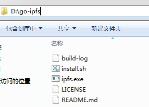
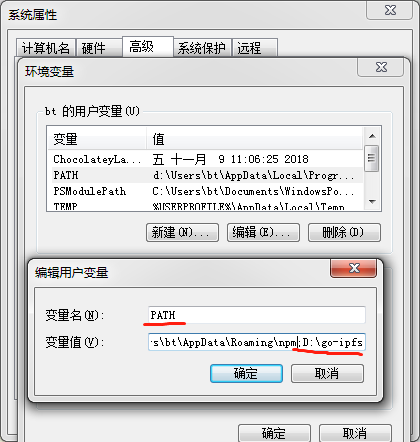
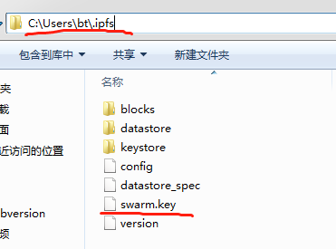

# IPFS Installation

## Requirement

- System: Windows or Linux
- RAM: 16GB+
- Disk: 500GB+

## IPFS Installation

### 1.Get File Installation

Go to the IPFS website to download the installation files of the corresponding system (need to turn over the wall):[https://dist.ipfs.io/#go-ipfs](https://dist.ipfs.io/#go-ipfs)

### 2.Installation

#### 1.Windows

##### 1.Unzip the installation file, then double-click ipfs.exe。



##### 2.Add the file path to the environment variable path.



#### 2.Linux

##### 1.Decompression

```bash
tar xvfz go-ipfs_v0.4.15_linux-amd64.tar.gz
```

##### 2.Configuration environment

```bash
cd go-ipfs
# Moves. / IPFs to the / usr / local / bin folder
./install.sh
```

#### 3.Verify successful installation

The following commands can be run anywhere (Windows opens the command window CMD to execute commands). Represents successful installation.

```bash
ipfs help
```

## Start IPFS nodes and join private chains

### 1.Init node

```bash
ipfs init
```

### 2.Remove all default bootstrap nodes

```bash
ipfs bootstrap rm –all
```

### 3.Adding Private Chain Nodes

```bash
ipfs bootstrap add /ip4/119.3.15.140/tcp/4001/ipfs/QmeDwr8nqLvk1ZJv5XTW2HbuybECFAHRPiKxKpH5oc8Nbe
```

### 4.Add credentials

Put [swarm.key](http://misnetwork.io/assets/lib/swarm.key) files in the IPFs folder. (Windows version. IPFs folder in the user directory, liunx version in the root directory)



### 5.Start node

```bash
ipfs daemon
```

### 6.Verify success

```bash
ipfs cat QmZA38zqh2AFjJzSZ1EMDv18THJmWZ5eXKs8w2KFtRUMdT
```


