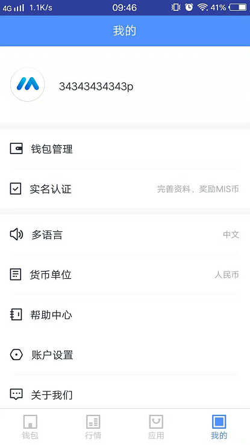
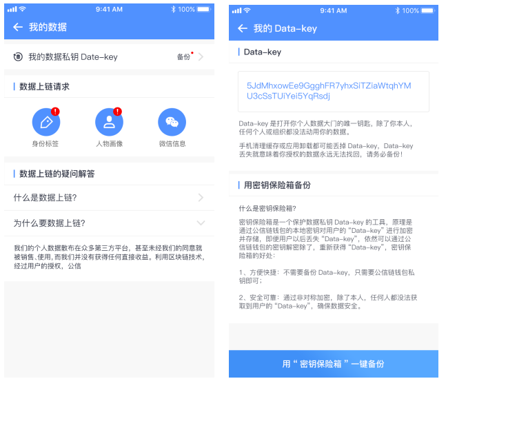
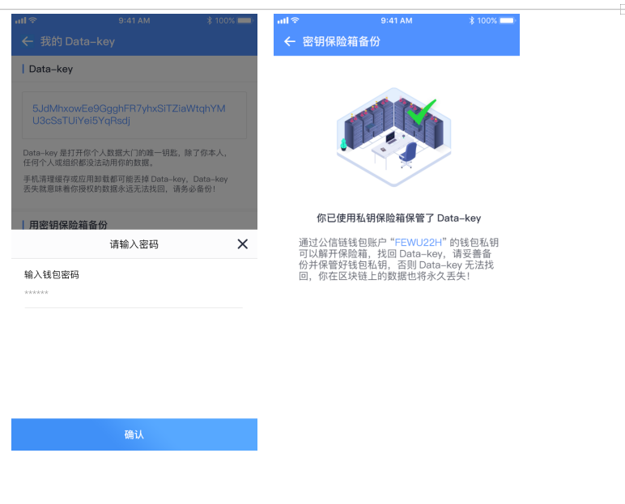
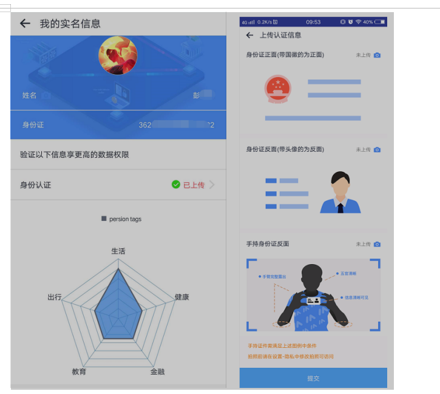
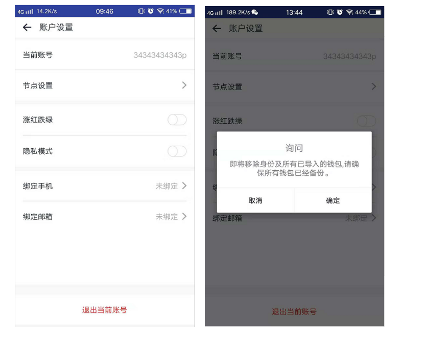
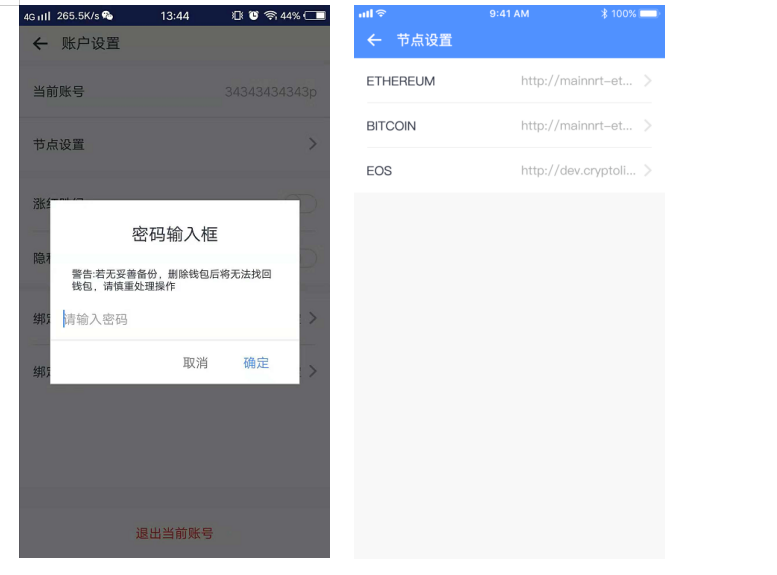
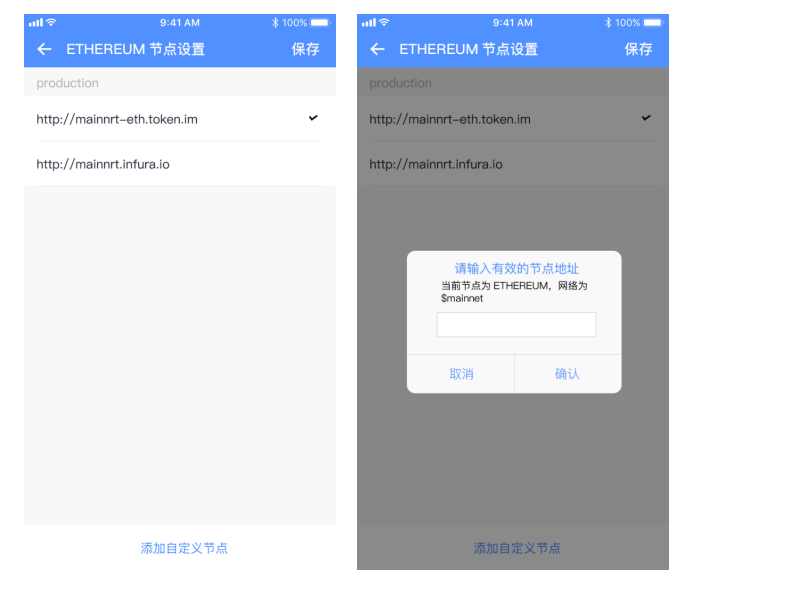

# Personal Center

## Personal center homepage

| precondition              | User logged in successfully                                          |
| :------------------------ | :------------------------------------------------------------------- |
| Triggering event          | Log in to register                                                   |
| The success scenario      | Display corresponding pages                                          |
| Error scenarios           | The operation fails, and the system gives the reason for the failure |
| Functional specifications | User personal information management                                 |
| The operator              | All users                                                            |

UI diagram: Personal center interface

> Interface elements -- input and button

<table>
    <tr>
        <th>Name</th>
        <th>Rules</th>
    </tr>
    <tr>
        <th>Personal Information</th>
        <th style="text-align:left;">
             Display users' personal information (personal data, wallet management, real name authentication, node setting, multi-language, monetary unit, help center, account setting, about us)
        </th>
    </tr>
</table>

## My data

| precondition              | User login and upload information                                    |
| :------------------------ | :------------------------------------------------------------------- |
| Triggering event          | Click personal data to enter                                         |
| The success scenario      | Display corresponding pages                                          |
| Error scenarios           | The operation fails, and the system gives the reason for the failure |
| Functional specifications | Obtain appropriate labels by completing the information              |
| The operator              | All users                                                            |

UI schematic: Personal data label interface

> Interface elements -- input and button

<table>
    <tr>
        <th>Name</th>
        <th>Rules</th>
    </tr>
    <tr>
        <th>Back up the data private key</th>
        <th>
             <ul style="text-align:left;">
                <li>Users backup their Data-Key, and need to be authorized by WeChat information and upload the portrait (personal identity authentication).</li>
                <li>The user enters my Data page, clicks backup, and can view the user's data-key. Click "back up with Key safe", input the wallet password, and enter the Key safe page. Click "back up with Key" to ensure the privacy of personal information. If the user does not perform WeChat information authorization and character portrait uploading, click backup to jump to WeChat authorization interface</li>
                <li>The new user did not perform data private key backup, the system gave a "red dot" prompt, and did not perform data link request operation red icon prompt</li>
            </ul>
        </th>
    </tr>
    <tr>
        <th>Data link requests</th>
        <th>
             <ul style="text-align:left;">
                <li>The user completes the operation of WeChat information and character portrait data upload, and the personal identity label system is perfected automatically</li>
                <li>Users click on the portrait to enter the upload authentication information interface, upload image data (mobile phone is set to allow access status), and click submit</li>
                <li>The user clicks WeChat information for authorization operation</li>
            </ul>
        </th>
    </tr>
    <tr>
        <th>About the data on the chain</th>
        <th style="text-align:left;">
           Users can more effectively understand the information of the data link by viewing the problem interpretation of the data link  
        </th>
    </tr>
</table>

## DailyCash

| precondition              | User login account                                                   |
| :------------------------ | :------------------------------------------------------------------- |
| Triggering event          | Click the wallet management button                                   |
| The success scenario      | Display corresponding pages                                          |
| Error scenarios           | The operation fails, and the system gives the reason for the failure |
| Functional specifications | Wallet management list and presentation of wallet operations         |
| The operator              | All users                                                            |

> Interface elements -- input and button

<table>
    <tr>
        <th>Name</th>
        <th>Rules</th>
    </tr>
    <tr>
        <th>DailyCash</th>
        <th style="text-align:left;">
             The user can import/export/delete the wallet owned by the user by clicking wallet management. Details can be seen in [wallet function - wallet management].
        </th>
    </tr>
</table>

## Help Center

| precondition              | User login account                                                   |
| :------------------------ | :------------------------------------------------------------------- |
| Triggering event          | Click the help center button                                         |
| The success scenario      | Display corresponding pages                                          |
| Error scenarios           | The operation fails, and the system gives the reason for the failure |
| Functional specifications | Provide users with operational questions                             |
| The operator              | All users                                                            |

> Interface elements -- input and button

<table>
    <tr>
        <th>Name</th>
        <th>Rules</th>
    </tr>
    <tr>
        <th>Search Help</th>
        <th style="text-align:left;">
           Users can find the solution of the modification by keyword search or problem search 
        </th>
    </tr>
     <tr>
        <th>Different types of questions</th>
        <th style="text-align:left;">
            Users look for related solutions according to different problem types, which mainly include
        </th>
    </tr>
     <tr>
        <th>Contact us</th>
        <th style="text-align:left;">
            The customer encountered a problem that the help center could not solve, but could contact the customer service
        </th>
    </tr>
</table>

## Real-name authentication

| precondition              | The user login                                                       |
| :------------------------ | :------------------------------------------------------------------- |
| Triggering event          | Click real name authentication to enter                              |
| The success scenario      | Display corresponding pages                                          |
| Error scenarios           | The operation fails, and the system gives the reason for the failure |
| Functional specifications | User authentication                                                  |
| The operator              | All users                                                            |

UI schematic: Real name authentication interface

> Interface elements -- input and button

<table>
    <tr>
        <th>Name</th>
        <th>Rules</th>
    </tr>
    <tr>
        <th>The identity authentication</th>
        <th>
             <ul style="text-align:left;">
                <li>When new users are not authenticated, they can click identity authentication, upload image data and click submit. After third-party authentication is successful, the name and id number system in the real name information will be filled automatically. Users who fail to match must reupload the image data</li>
                <li>Perfect the real name authentication information, may obtain the MIS currency reward</li>
            </ul>
        </th>
    </tr>
    <tr>
        <th>Individual labels</th>
        <th>
             <ul style="text-align:left;">
                <li>User personal data analysis chart</li>
                <li>Personal label data distribution display needs to bind the phone number successfully</li>
            </ul>
        </th>
    </tr>
    <tr>
        <th></th>
        <th>
             <ul style="text-align:left;">
                <li>Authentication status: unverified, failed, passed</li>
                <li>There is no picture upload operation. Name and id number are unknown</li>
                <li>User authentication passed, upload the identity information page can not click enter</li>
                <li>Users need to create a wallet to authenticate with their real name</li>
            </ul>
        </th>
    </tr>
</table>

## Multiple Language

| Overview                  | User's personal Settings                                             |
| :------------------------ | :------------------------------------------------------------------- |
| precondition              | Without                                                              |
| Triggering event          | Click personal center to enter                                       |
| The success scenario      | Display corresponding pages                                          |
| Error scenarios           | The operation fails, and the system gives the reason for the failure |
| Functional specifications | Users can access app functions through Settings                      |
| The operator              | All users                                                            |

> Interface elements -- input and button

<table>
    <tr>
        <th>Name</th>
        <th>Rules</th>
    </tr>
    <tr>
        <th>Language switching</th>
        <th style="text-align:left;">
            Used for Chinese/English switching of app language
        </th>
    </tr>
</table>

## Monetary Unit

| Overview                  | User's personal Settings                                             |
| :------------------------ | :------------------------------------------------------------------- |
| precondition              | Without                                                              |
| Triggering event          | Click personal center to enter                                       |
| The success scenario      | Display corresponding pages                                          |
| Error scenarios           | The operation fails, and the system gives the reason for the failure |
| Functional specifications | Users can access app functions through Settings                      |
| The operator              | All users                                                            |

> Interface elements -- input and button

<table>
    <tr>
        <th>Name</th>
        <th>Rules</th>
    </tr>
    <tr>
        <th>Currency unit selection</th>
        <th style="text-align:left;">
           Optional currency unit (CNY/USD)
        </th>
    </tr>
</table>

## Account Settings

| Overview                  | User's personal Settings                                             |
| :------------------------ | :------------------------------------------------------------------- |
| precondition              | The user login                                                       |
| Triggering event          | Click on Settings to enter                                           |
| The success scenario      | Display corresponding pages                                          |
| Error scenarios           | The operation fails, and the system gives the reason for the failure |
| Functional specifications | Users can access app functions through Settings                      |
| The operator              | All users                                                            |

UI schematic: Sets the interface

> Interface elements -- input and button

<table>
    <tr>
        <th>Name</th>
        <th>Rules</th>
    </tr>
    <tr>
        <th>Node set</th>
        <th style="text-align:left;">
            Add custom node addresses for different currencies
        </th>
    </tr>
     <tr>
        <th>Red down green</th>
        <th style="text-align:left;">
            Users can switch the configuration according to their personal usage mode, and the system default is red up green mode
        </th>
    </tr>
     <tr>
        <th>Hidden mode</th>
        <th>
             <ul style="text-align:left;">
               In the hidden mode, the user clicks on the asset and amount of the wallet menu for the hidden operation
            </ul>
        </th>
    </tr>
    <tr>
        <th>Mobile phone binding</th>
        <th>
             <ul style="text-align:left;">
                <li>Binding user phone number, users can use mobile phone number as account for the login operation</li>
                <li>The user can use the binding phone to recover the account password</li>
                <li>A phone number can only be tied to a wallet user</li>
            </ul>
        </th>
    </tr>
     <tr>
        <th>Email address</th>
        <th>
             <ul style="text-align:left;">
                <li>Bind user mobile phone number, user can use email account to log in operation</li>
                <li>User can use bind mailbox to recover account password</li>
                <li>A phone number can only be tied to a wallet user</li>
            </ul>
        </th>
    </tr>
     <tr>
        <th>About us</th>
        <th style="text-align:left;">
            View the wallet-related version information
        </th>
    </tr>
     <tr>
        <th>Logout</th>
        <th style="text-align:left;">
            When the user clicks out to log in and re-opens the APP, the user needs to use the account name and password to log in. Users can directly enter the app without logging in if they directly close the app without quitting
        </th>
    </tr>
</table>