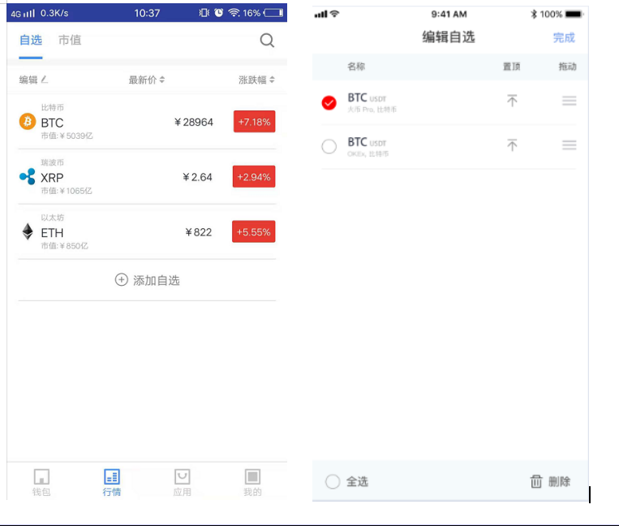
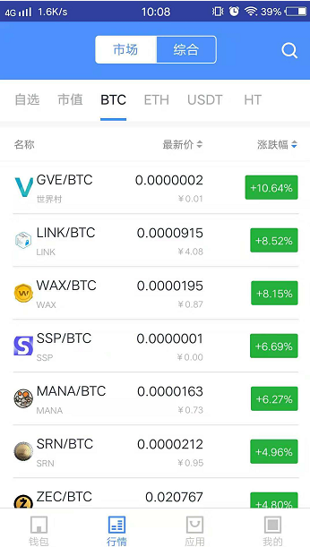
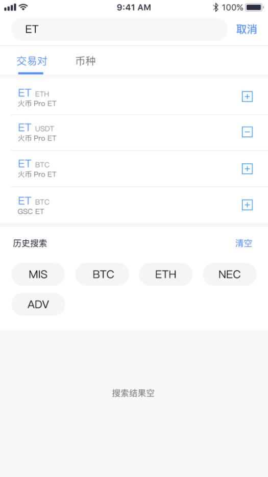
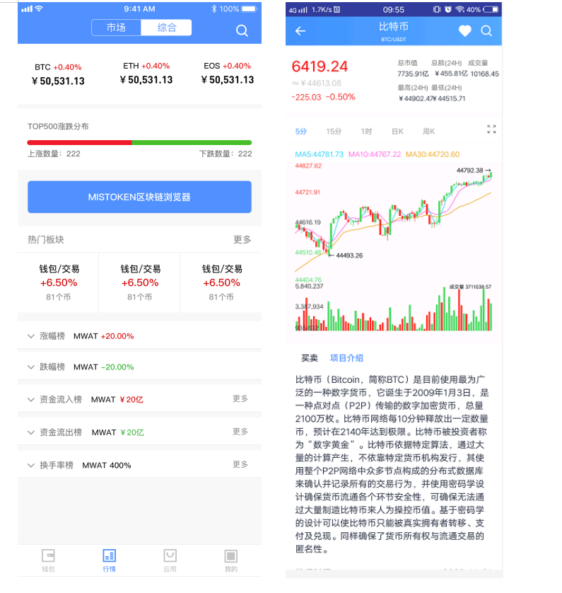
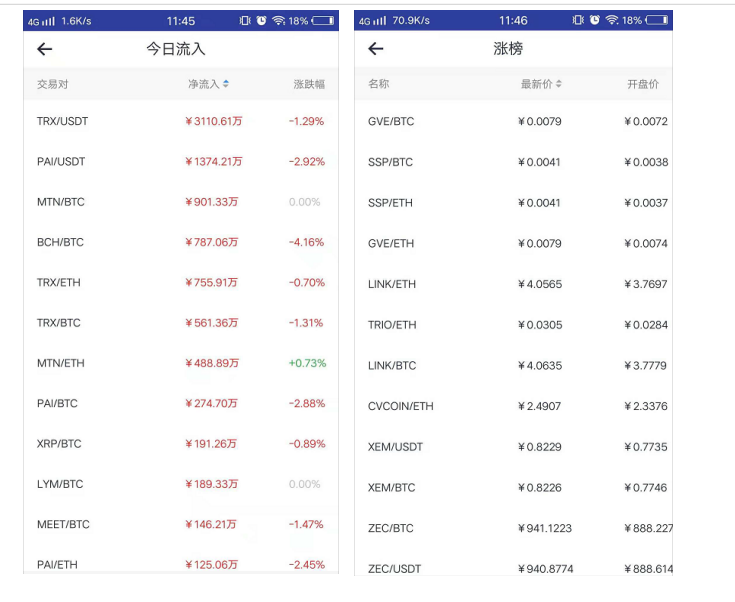
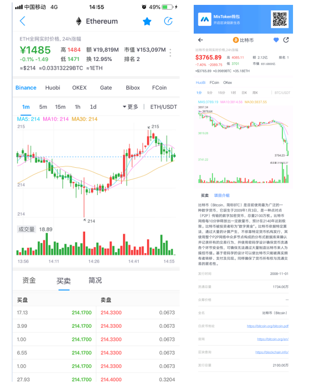

# 行情

## 自选

| precondition              | 所有                                                                 |
| :------------------------ | :------------------------------------------------------------------- |
| Triggering event          | 点击加入自选按钮                                                     |
| The success scenario      | 自选界面拥有该交易对                                                 |
| Error scenarios           | The operation fails, and the system gives the reason for the failure |
| Functional specifications | 用户可将个人关注的各种交易对添加至自选列表                           |
| The operator              | All users                                                            |

UI示意图：自选界面

> Interface elements -- input and button

<table>
    <tr>
        <th>名称</th>
        <th>规则</th>
    </tr>
    <tr>
        <th>自选</th>
        <th>
             <ul style="text-align:left;">
                <li>页面展示用户所添加的所有交易对信息列表</li>
                <li>自选交易对可按照市场的最新价高低、涨跌幅度进行排序，交易对的市场价值与涨跌幅为实时更新，用户可查看最新数据</li>
                <li>用户查看交易对最新价值，点击最新价按钮，自选交易对按价值由高到低排序；再次点击最新价按钮，自选交易对按价值由低至高排序，三次点击则按用户自选编辑中的拖动排序（用户查交易对看涨跌幅操作一致，点击涨跌幅按钮即可）</li>
                <li>点击任意自选交易对，可查看该交易对走势详情</li>
                <li>点击涨跌幅数值可对涨跌幅、总市值、成交量值随意切换查看</li>
            </ul>
        </th>
    </tr>
    <tr>
        <th>编辑自选</th>
        <th style="text-align:left;">
             用户可将已添加的交易对进行删除（全选/单选）、拖动排序、置顶操作，点击“完成”保存即可
        </th>
    </tr>
    <tr>
        <th>添加自选</th>
        <th style="text-align:left;">
           用户点击添加自选按钮，输入币种名称/交易对，选择添加所需要的币种或交易对
        </th>
    </tr>
     <tr>
        <th>搜索</th>
        <th style="text-align:left;">
            点击所搜按钮，跳转搜索页面，操作详情可见【搜索】
        </th>
    </tr>
</table>

## 市值

| precondition              | 无                                                                   |
| :------------------------ | :------------------------------------------------------------------- |
| Triggering event          | 点击市值tab选项卡                                                    |
| The success scenario      | Display corresponding pages                                          |
| Error scenarios           | The operation fails, and the system gives the reason for the failure |
| Functional specifications | 主要展示不同币种按照市值排序                                         |
| The operator              | All users                                                            |

UI示意图：市值排序界面

> Interface elements -- input and button

<table>
    <tr>
        <th>名称</th>
        <th>规则</th>
    </tr>
    <tr>
        <th>查看市值</th>
        <th style="text-align:left;">
            用户可查看不同币种的市场价值与今日涨跌幅，页面展示所有的币种排序，根据价值由高到低排列
        </th>
    </tr>
    <tr>
        <th>搜索</th>
        <th style="text-align:left;">
           用户点击搜索按钮，查询相关币种的价值详情
        </th>
    </tr>
</table>

## 交易对列表展示

| precondition              | 无                                                                   |
| :------------------------ | :------------------------------------------------------------------- |
| Triggering event          | 点击市值tab选项卡                                                    |
| The success scenario      | Display corresponding pages                                          |
| Error scenarios           | The operation fails, and the system gives the reason for the failure |
| Functional specifications | 主要展示不同交易对的价值与涨跌幅                                     |
| The operator              | All users                                                            |

UI示意图：交易对列表界面

> Interface elements -- input and button

<table>
    <tbody>
        <tr>
            <th>名称</th>
            <th>规则</th>
        </tr>
        <tr>
            <th rowspan="3">查看交易对</th>
            <td>用户可选择以BTC/ETH/USDP为基础查看不同币种的最新价与涨跌幅，选择点击任意交易对可查看该交易对的走势详情</td>
        </tr>
        <tr>
            <td>用户点击涨跌值，可切换查看涨跌幅、市值、成交额</td>
        </tr>
         <tr>
            <td>交易对的默认排序为涨跌幅由高到低排列</td>
        </tr>
         <tr>
            <th>搜索</th>
            <td>用户点击搜索图标，搜索查看具体的某一交易对的信息</td>
        </tr>
    </tbody>
</table>

## 搜索

| 概述                      | 可以搜索交易对                                                       |
| :------------------------ | :------------------------------------------------------------------- |
| precondition              | 无                                                                   |
| Triggering event          | 点击搜索进入                                                         |
| The success scenario      | Display corresponding pages                                          |
| Error scenarios           | The operation fails, and the system gives the reason for the failure |
| Functional specifications | 提供用户搜索查看交易对与币种信息                                     |
| The operator              | All users                                                            |

UI示意图：搜索界面

> Interface elements -- input and button

<table>
    <tr>
        <th>名称</th>
        <th>规则</th>
    </tr>
    <tr>
        <th>输入</th>
        <th>
             <ul style="text-align:left;">
                <li>用户需输入交易对/币种进行搜索</li>
                <li>用户查询输入错误时，页面信息提示“搜索结果为空”</li>
            </ul>
        </th>
    </tr>
    <tr>
        <th>移出/添加自选</th>
        <th style="text-align:left;">
            用户选择搜索的交易对或币种进行移出/添加操作，“-”表示自选列表已添加该交易对/币种，再次点击为移出操作，则自选列表不显示已取消的交易对/币种，“+”表示添加交易对/币种
        </th>
    </tr>
    <tr>
        <th>查看详情</th>
        <th style="text-align:left;">
           选择任意搜索的交易对/币种，可查看走势详情
        </th>
    </tr>
    <tr>
        <th>历史记录</th>
        <th>
             <ul style="text-align:left;">
                <li>展示用户输入搜索交易对/币种的历史记录，同时用户可对历史搜索记录进行清空操作</li>
                <li>历史记录列表展示最新的20条记录</li>
            </ul>
        </th>
    </tr>
</table>

## 综合分析

| precondition              | 无                                                                   |
| :------------------------ | :------------------------------------------------------------------- |
| Triggering event          | 点击综合tab进入                                                      |
| The success scenario      | Display corresponding pages                                          |
| Error scenarios           | The operation fails, and the system gives the reason for the failure |
| Functional specifications | 对数据进行不同维度的分析展示，方便用户查看                           |
| The operator              | All users                                                            |

UI示意图：综合界面

> Interface elements -- input and button

<table>
    <tr>
        <th>名称</th>
        <th>规则</th>
    </tr>
    <tr>
        <th>交易对分析</th>
        <th style="text-align:left;">
            显示已币种USDT为基础的BTC/ETH/EOS交易对的价值与涨跌幅，用户可选择点击任一交易对查看详情。具体信息可查看【交易对详情】
        </th>
    </tr>
    <tr>
        <th>搜索</th>
        <th style="text-align:left;">
            点击搜索图标，搜索查看某一交易对、币种信息
        </th>
    </tr>
    <tr>
        <th>MISTOKEN区块浏览器</th>
        <th style="text-align:left;">
            点击区块浏览器，进入浏览器页面，可查看所有的交易记录，具体页面展示可查看【区块链浏览器】
        </th>
    </tr>
    <tr>
        <th>涨跌分布</th>
        <th style="text-align:left;">
            用户可查看世界前500币种的涨跌分布图，统计显示上涨/下跌数量
        </th>
    </tr>
    <tr>
        <th>热门板块</th>
        <th>
             <ul style="text-align:left;">
                <li>页面主要展示了三款热门板块信息</li>
                <li>用户需查看更多板块，可点击“热门板块”中的更多按钮，进入板块的列表展示，展示所有的板块信息</li>
            </ul>
        </th>
    </tr>
    <tr>
        <th>涨幅榜</th>
        <th>
             <ul style="text-align:left;">
                <li>用户点击下拉显示图标，系统显示涨幅前4的币种信息</li>
                <li>用户需查看更多的币种的涨幅可点击“更多”进入涨幅榜界面，查看所有的币种详情（价格/涨幅/成交量）</li>
                <li>用户可根据价格/涨幅/成交量高低进行切换排序</li>
            </ul>
        </th>
    </tr>
     <tr>
        <th>跌幅榜</th>
        <th>
             <ul style="text-align:left;">
                <li>用户点击下拉显示图标，系统显示跌幅前4的币种信息</li>
                <li>用户需查看更多的币种的跌幅可点击“更多”进入跌幅榜界面，查看所有的币种详情（价格/跌幅/成交量）</li>
                <li>用户可根据价格/涨幅/成交量高低进行切换排序</li>
            </ul>
        </th>
    </tr>
     <tr>
        <th>资金流入榜</th>
        <th>
             <ul style="text-align:left;">
                <li>用户点击下拉显示图标，系统显示今日资金流入前4的币种信息</li>
                <li>用户需查看更多的币种的资金流入，可点击“更多”进入今日流向界面，查看所有的交易对资金流入详情（净流入/占成交额比例）</li>
                <li>用户根据净流入高低/占成交额比例进行切换排序</li>
            </ul>
        </th>
    </tr>
     <tr>
        <th>资金流出榜</th>
        <th>
             <ul style="text-align:left;">
                <li>用户点击下拉显示图标，系统显示今日资金流出前4的币种信息</li>
                <li>用户需查看更多的币种的资金流出，可点击“更多”进入今日流向界面查看所有的交易对资金流出详情（净流出/占成交额比例）</li>
                <li>用户根据净流出高低/占成交额比例进行切换排序</li>
            </ul>
        </th>
    </tr>
</table>

## 交易对详情

| precondition              | 无                                                                   |
| :------------------------ | :------------------------------------------------------------------- |
| Triggering event          | 点击交易对进入                                                       |
| The success scenario      | Display corresponding pages                                          |
| Error scenarios           | The operation fails, and the system gives the reason for the failure |
| Functional specifications | 查看交易对详情                                                       |
| The operator              | All users                                                            |

UI示意图：详情界面

> Interface elements -- input and button

<table>
    <tr>
        <th>名称</th>
        <th>规则</th>
    </tr>
    <tr>
        <th>K线图</th>
        <th style="text-align:left;">
             根据不同时间间隔对交易对详情进行K线图展示
        </th>
    </tr>
    <tr>
        <th>币种介绍</th>
        <th style="text-align:left;">
           展示币种的概述
        </th>
    </tr>
     <tr>
        <th>数据分析</th>
        <th style="text-align:left;">
            币种的资金流入流出、最高最低价分析展示
        </th>
    </tr>
    <tr>
        <th>买卖深度</th>
        <th style="text-align:left;">
           展示当前币种买卖的挂单信息
        </th>
    </tr>
     <tr>
        <th>收藏交易对</th>
        <th style="text-align:left;">
            用户点击收藏添加按钮，可将该交易对添加至自选交易对列表
        </th>
    </tr>
    <tr>
        <th>搜索</th>
        <th style="text-align:left;">
            点击搜索按钮，进入搜索页面，进行搜索操作
        </th>
    </tr>
    <tr>
        <th></th>
        <th>
             <ul style="text-align:left;">
                <li>用户对交易对详情信息截图分享，系统自动附带Mission钱包应用二维码，方便用户了解更多的钱包应用详情</li>
            </ul>
        </th>
    </tr>
</table>
