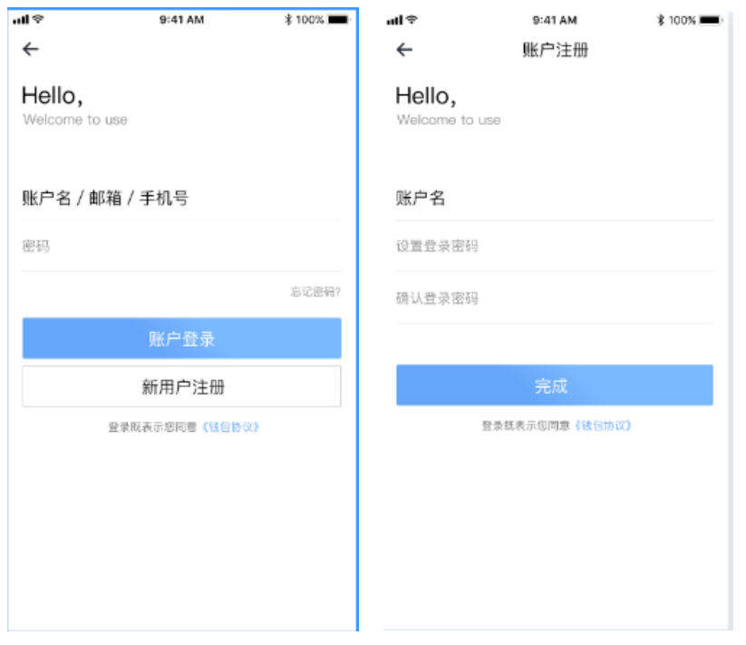
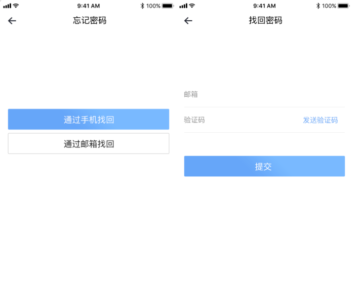
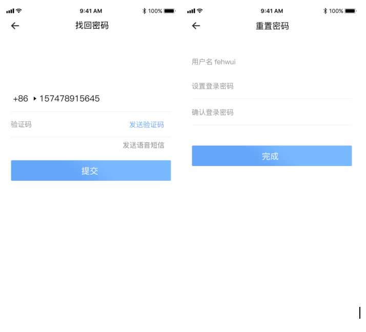

# Login/Register

| precondition              | User registration/login                                              |
| :------------------------ | :------------------------------------------------------------------- |
| Triggering event          | View user information                                                |
| The success scenario      | Display corresponding pages                                          |
| Error scenarios           | The operation fails, and the system gives the reason for the failure |
| Functional specifications | User login/register APP operation                                    |
| The operator              | All users                                                            |

UI diagram: Login registration interface

> Interface elements -- input and button

<table>
    <tr>
        <th>The name of the</th>
        <th>Rules</th>
    </tr>
    <tr>
        <th>Login</th>
        <th>
            <ul style="text-align:left;">
                <li>The user can login the APP in three ways: user name, phone number and mailbox</li>
                <li>When using mobile phone number and mailbox as account name, the user must bind successfully in advance</li>
                <li>The login password is a universal password for different login modes</li>
                <li>In the case that the user does not log out, he/she quits the app and does not need to log in again when opening the app again. If the user has logged out, he/she needs to log in again</li>
            </ul>
        </th>
    </tr>
    <tr>
        <th>New user registration</th>
        <th>
            <ul style="text-align:left;">
                <li>Click "new user registration" button to enter the account registration page and enter the login name and password of the wallet app. Click "finish"</li>
                <li>After registration, the new user can enter the front page of the wallet to create/import the wallet, or click "my" to enter the personal center to view the account information. If the user does not create the wallet, he/she should return to the operation of creating/importing the wallet, and click "wallet" in the navigation menu</li>
            </ul>
        </th>
    </tr>
     <tr>
        <th>Forgot password</th>
        <th>
            <ul style="text-align:left;">
                <li>If the user forgets his/her password, he/she can retrieve it through his/her phone number and mailbox, and manually enter the mailbox/phone number to receive the verification code</li>
                <li>Users can choose to receive the authentication code: mobile phone authentication code</li>
                <li>After the password is reset, the user needs to re-login the wallet APP with the new password</li>
            </ul>
        </th>
    </tr>
</table>
