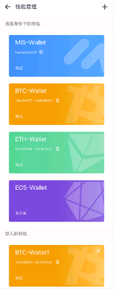
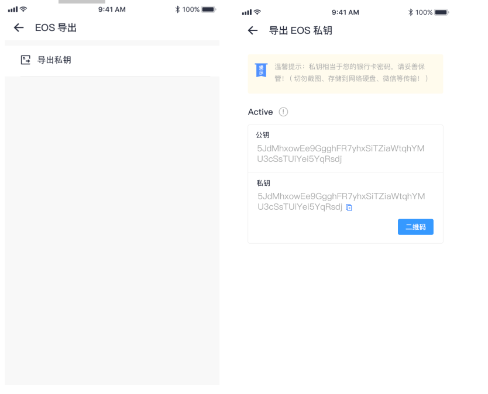

# The wallet function

> Feature list

<table>
    <tbody>
        <tr>
            <th>Function</th>
            <th>Subfunction</th>
            <th>Functional description</th>
        </tr>
        <tr>
            <th rowspan="2">The wallet</th>
            <th>An overview of the assets</th>
            <td>Total assets, today's earnings, today's gains, wallet management (create, export, check transaction records, transfer, receive)</td>
        </tr>
        <tr>
            <th>Assets list</th>
            <td>Basic details of BTC, ETH, EOS, MIS, trial currency</td>
        </tr>
        <tr>
            <th rowspan="2">Application</th>
            <th>Magic trial</th>
            <td>The trial mall</td>
        </tr>
        <tr>
            <th>Blockchain browser</th>
            <td>Blockchain browser</td>
        </tr>
        <tr>
            <th rowspan="5">The market</th>
            <th>Self-selected transaction pair</th>
            <td>Data display of self-selected trading pair (data source: coin exchange)</td>
        </tr>
        <tr>
            <th>Transaction pair list</th>
            <td>All transactions based on the exchange will be displayed according to different datum values and the order of different conditions</td>
        </tr>
        <tr>
            <th>Search</th>
            <td>Search all currencies of the currency exchange for viewing</td>
        </tr>
         <tr>
            <th>Comprehensive</th>
            <td>Conduct data analysis of different dimensions based on all currencies of the exchange for users to view and compare</td>
        </tr>
        <tr>
            <th>Transaction details</th>
            <td>Based on the basic data, currency introduction, data analysis, purchase order and K chart of different dimensions of the main currency</td>
        </tr>
        <tr>
            <th rowspan="9">Personal center</th>
            <th>User login registration</th>
            <td>User registration and login</td>
        </tr>
        <tr>
            <th>Account Settings</th>
            <td>Current account display, mobile phone number binding, email binding, privacy setting, red and green setting, node setting, and exit account</td>
        </tr>
        <tr>
            <th>Personal data label</th>
            <td>Backup data-key, WeChat authorization, and upload user id information</td>
        </tr>
        <tr>
            <th>Real-name authentication</th>
            <td>Upload status for authentication (reward mis)</td>
        </tr>
        <tr>
            <th>The wallet management</th>
            <td>Wallet creation, export, inquiry transaction record, transfer, collection</td>
        </tr>
        <tr>
            <th>Multilingual</th>
            <td>Language mode switch (Chinese/English)</td>
        </tr>
        <tr>
            <th>Monetary unit</th>
            <td>Currency unit switching options (RMB/USD)</td>
        </tr>
        <tr>
            <th>Help</th>
            <td>User questions, contact us</td>
        </tr>
        <tr>
            <th>About us</th>
            <td>Application version information</td>
        </tr>
    </tbody>
</table>

## Wallt

## Summary of assets

| precondition              | The user has logged in                                                                      |
| :------------------------ | :------------------------------------------------------------------------------------------ |
| Triggering event          | The user clicks on the wallet navigation bar                                                |
| Error scenarios           | Error reporting or direct login prompt                                                      |
| Functional specifications | This function mainly provides users to manage personal wallet assets and view wallet income |
| The operator              | All users                                                                                   |

UI schematic: Wallet menu

> Interface elements - input

<table>
    <tr>
        <th>Name</th>
        <th>Rules</th>
    </tr>
    <tr>
        <th>Amount of assets</th>
        <th style="text-align:left;">
            Click the asset amount to hide or show the user's total asset amount, to ensure the asset confidentiality to display the income of the total asset amount today, the rise and fall today, to facilitate the user to view the asset income
        </th>
    </tr>
    <tr>
        <th>The wallet type</th>
        <th style="text-align:left;">
           Users can view the amount of wallet of different types according to the type of wallet
        </th>
    </tr>
     <tr>
        <th>The wallet management</th>
        <th style="text-align:left;">
            Go to the wallet management page to export your wallet
        </th>
    </tr>
    <tr>
        <th>Import new wallet</th>
        <th style="text-align:left;">
            The user can import other wallets of the user in different ways to facilitate the unified management of the user. The import operation details can be seen as: MIS wallet (mnemonic word, private key), BTC (mnemonic word, private key), ETH (Keystore, mnemonic word, private key), EOS wallet (private key, ETH private key)
        </th>
    </tr>
    <tr>
        <th>Payment code</th>
        <th style="text-align:left;">
           The qr code displays the collection information of the user (the default of the collection wallet is MIS_wallet)
        </th>
    </tr>
     <tr>
        <th>Scan the transfer</th>
        <th style="text-align:left;">
            Scan transfer function between users (mobile phone is set to allow access). The user clicks the scan button to identify the type of receiving code and jump to the transfer page of the corresponding wallet
        </th>
    </tr>
     <tr>
        <th></th>
        <th>
             <ul style="text-align:left;">
                <li>Users can import multiple wallets of the same currency, and manage the same type of wallet with serial Numbers</li>
                <li>Currency classification: MIS/DAPP/ others (other categories include all third party digital currency except MIS/DAPP)</li>
                <li>The wallet quota is the sum of all wallet quotas</li>
                <li>The categories in the wallet home page list show the wallets created under the current identity and manually imported wallets</li>
                <li>When the user logs out of the current wallet, the wallet must be re-imported</li>
            </ul>
        </th>
    </tr>
</table>

## Create a wallet

| precondition              | The user has logged in                                               |
| :------------------------ | :------------------------------------------------------------------- |
| Triggering event          | Click the create wallet button                                       |
| The success scenario      | Display corresponding pages                                          |
| Error scenarios           | The operation fails, and the system gives the reason for the failure |
| Functional specifications | User creates new wallet function                                     |
| The operator              | All users                                                            |

UI schematic: Create a wallet and backup mnemonic interface

> Interface elements - input

<table>
    <tr>
        <th>Name</th>
        <th>Rules</th>
    </tr>
    <tr>
        <th>Wallet name and password</th>
        <th style="text-align:left;">
            A new user enters a password and confirms it to create a wallet, which by default fills in the account name that the user entered when registering the APP
        </th>
    </tr>
    <tr>
        <th>Backup mnemonic</th>
        <th style="text-align:left;">
           The user copied the backup mnemonic words generated by the system in order, and clicked "next step" to perform the second verification
        </th>
    </tr>
     <tr>
        <th>Confirmation mnemonic</th>
        <th style="text-align:left;">
            When the user reconfirms mnemonic words, click to fill in mnemonic words in order to ensure correct backup
        </th>
    </tr>
     <tr>
        <th></th>
        <th>
             <ul style="text-align:left;">
                <li>Make sure mnemonic words are correctly backed up before removing them. After removing, the current wallet has no mnemonic words but users can import them again by importing mnemonic functions</li>
                <li>Backup mnemonic words as far as possible not to take screenshots or photographs, as far as possible to use physical media backup, such as copying with pen, in case of omission and loss.</li>
                <li>When a new user creates a wallet, the system will create four types of wallet by default: Mission wallet/bitcoin wallet/ethereum wallet /EOS wallet, and the wallet password will be the uniform password set when the user creates the wallet</li>
                <li>The user creates a wallet backup mnemonic word, which is used for wallets created by default by the system</li>
                <li>The account name entered by the user when registering the app is the wallet name, and the default is the MIS wallet address</li>
                <li>The system creates EOS wallet as unregistered by default, and users need to register the wallet in the management of wallet. Details can be seen in [wallet management -- registration of EOS account].</li>
            </ul>
        </th>
    </tr>
</table>

## Details on the wallet

| precondition              | The user has created or imported the wallet                                                                                                                       |
| :------------------------ | :---------------------------------------------------------------------------------------------------------------------------------------------------------------- |
| Triggering event          | The user clicks the corresponding wallet to enter                                                                                                                 |
| The success scenario      | The user enters the appropriate page                                                                                                                              |
| Error scenarios           | The user cannot access the appropriate page                                                                                                                       |
| Functional specifications | This function is mainly about the overview of wallet and user's operation of wallet (money transfer, collection, quotation, export and view transaction records). |
| The operator              | All users                                                                                                                                                         |

UI schematic: Wallet details

> Interface elements - input

<table>
    <tr>
        <th>Name</th>
        <th>Rules</th>
    </tr>
    <tr>
        <th>Copy of wallet address</th>
        <th style="text-align:left;">
            The user can copy and forward the wallet address to transfer the money
        </th>
    </tr>
    <tr>
        <th>Scan the transfer</th>
        <th style="text-align:left;">
           The user scans the qr code to get the receiving address for the transfer
        </th>
    </tr>
     <tr>
        <th>Transfer</th>
        <th style="text-align:left;">
            Enter transfer interface
        </th>
    </tr>
    <tr>
        <th>Collection</th>
        <th style="text-align:left;">
           Enter the payment collection interface (qr code)
        </th>
    </tr>
     <tr>
        <th>Market trends</th>
        <th style="text-align:left;">
          Enter the market details page of the selected currency to facilitate the user to view all trading pairs trend and rise and fall range based on the selected currency. For example, the selected currency is ETH(2), and users can check the trading pair trend and rise and fall range based on ETH
        </th>
    </tr>
    <tr>
        <th>Export the wallet</th>
        <th style="text-align:left;">
            Enter the wallet export page. Different types of wallet can be exported in different ways, such as MIS wallet (mnemonic/private key), BTC wallet (mnemonic/private key), ETH wallet (keystore/ mnemonic/private key), EOS wallet (private key), etc
        </th>
    </tr>
     <tr>
        <th>Transaction records</th>
        <th>
             <ul style="text-align:left;">
                <li>Display all transaction records of the currency. Click on a transaction record to view transaction details</li>
                <li>The user chooses to click any transaction record and can view the transaction details (amount, transaction status, transaction time, miner fees, address)</li>
                <li>The transaction details can be obtained by scanning the qr code</li>
                <li>Displays all transaction records (roll-out, roll-in, failure) of the user, "red" indicates roll-out;" Blue means go in</li>
            </ul>
        </th>
    </tr>
    <tr>
        <th>Resource management (EOS)</th>
        <th>
             <ul style="text-align:left;">
                <li>Resource management includes memory, bandwidth (CPU/NET)</li>
                <li>Distribution of total EOS assets: balance, redemption, mortgage</li>
                <li>To create an EOS account, users need to increase the EOS memory storage space to ensure that the data can be stored and modified at any time. Users need to use EOS to purchase in their system. When they buy, they input the amount of purchase and select the operation type (mortgage). When the user does not need memory, he can sell the excess memory to the system and redeem the corresponding EOS tokens</li>
                <li>The EOS bandwidth includes CPU, NET, and needs to occupy certain CPU and NET resources when the EOS application is applied. The user needs to lock a certain amount of token mortgage for exchange. The user enters the bandwidth page and input the amount of mortgage. Users do not need to consume too much CPU/NET when they can sell, redeem corresponding EOS tokens</li>
            </ul>
        </th>
    </tr>
    <tr>
        <th>Permission to view (EOS)</th>
        <th style="text-align:left;">
           The user can understand the EOS account's permission management. The private key corresponding to the public key with the icon "blue dot" exists in the current wallet, and the user can export the corresponding EOS private key when exporting the wallet
        </th>
    </tr>
     <tr>
        <th>Node vote (EOS)</th>
        <th>
             <ul style="text-align:left;">
                <li>The user clicks on the "wallet" icon in the interface, and the user entering the voting information page can see the detailed information of the user's EOS wallet, including the balance of EOS, the number of EOS mortgaged (the number of EOS that can be voted), and the current voting result</li>
                <li>Users can not redeem the mortgage before the main network is started in the voting details interface. When the number of votes of the nodes reaches the limit, the redemption operation can be conducted, and the voted nodes can apply to redeem the mortgaged EOS</li>
                <li>The user clicks the "view rule" button and enters the help center page to view the voting rules and matters needing attention</li>
                <li>The user can click the circle in the node list and select the node he wants to vote. The number of successful votes is increased, and the added node is displayed in the voting list. At the same time, users can click on a single list item to enter the details page of the node and view the information and voting of the node</li>
                <li>The user clicks the "direct vote" button on the details page of the node to enter the voting interface. At the same time, the user clicks the "to vote" button to enter the voting interface, and can vote on multiple candidate nodes at one time</li>
                <li>Node sorting (default/ranking/region). The user enters the node voting interface. The nodes are sorted by default</li>
                <li>Candidate node query, the user clicks the search icon, enters the search interface, enters the node name, selects the node to see the details</li>
                <li>Voting status: success or failure; The vote shows the failed state, can be re-cast, and the amount will not be deducted</li>
                <li>The user clicks the "X" icon in the interface to exit the voting operation</li>
                <li>The user clicks the refresh icon and the system updates the status of node sorting in real time</li>
                <li>An EOS can be mortgaged to one vote, one vote can be up to 30 candidate nodes at the same time, and each candidate node can be up to one vote</li>
            </ul>
        </th>
    </tr>
    <tr>
        <th></th>
        <th>
             <ul style="text-align:left;">
                <li>In the wallet details, you can see the total value of your wallet converted into RMB</li>
                <li>The status of transaction records: success, failure</li>
            </ul>
        </th>
    </tr>
</table>

## Transfer

| precondition              | Enter transfer interface                                             |
| :------------------------ | :------------------------------------------------------------------- |
| Triggering event          | Click the transfer button to enter                                   |
| The success scenario      | Display corresponding pages                                          |
| Error scenarios           | The operation fails, and the system gives the reason for the failure |
| Functional specifications | The function provides users with transfer operations                 |
| The operator              | All users                                                            |

UI diagram: Transfer interface

> Interface elements -- input and button

<table>
    <tr>
        <th>Name</th>
        <th>Rules</th>
    </tr>
    <tr>
        <th>Transfer amount</th>
        <th style="text-align:left;">
            The user can enter the transfer amount (the transfer amount is greater than zero and less than or equal to the assets held by the user)
        </th>
    </tr>
    <tr>
        <th>Transfer note</th>
        <th style="text-align:left;">
           The user fills in the notes for the transfer
        </th>
    </tr>
     <tr>
        <th>Payment account</th>
        <th style="text-align:left;">
            The user can identify the receiving address by scanning the qr code, paste the receiving address manually, and input the receiving address manually
        </th>
    </tr>
    <tr>
        <th>Select payment account</th>
        <th style="text-align:left;">
           The user selects the payment account
        </th>
    </tr>
     <tr>
        <th>Select fee paid (ETH/BTC)</th>
        <th>
            <ul style="text-align:left;">
                <li>User interface swipe right and left to select fees, according to the level of fees decided to transfer speed</li>
                <li>There is no transfer fee for EOS/MIS COINS</li>
            </ul>
        </th>
    </tr>
    <tr>
        <th>Confirm transfer (send)</th>
        <th style="text-align:left;">
            Enter your wallet password to confirm the transfer
        </th>
    </tr>
    <tr>
        <th></th>
        <th>
             <ul style="text-align:left;">
                <li>The interface shows the balance of the user's wallet (number held)</li>
                <li>Total amount of wallet held = transfer amount + transfer fee + wallet balance (ETH/BTC)</li>
            </ul>
        </th>
    </tr>
</table>

## Collection

| precondition              | The user successfully created or imported the wallet                 |
| :------------------------ | :------------------------------------------------------------------- |
| Triggering event          | Click collect to enter                                               |
| The success scenario      | Display corresponding pages                                          |
| Error scenarios           | The operation fails, and the system gives the reason for the failure |
| Functional specifications | Users can receive money by providing a wallet address                |
| The operator              | All users                                                            |

UI diagram: Collection interface

> Interface elements -- input and button

<table>
    <tr>
        <th>Name</th>
        <th>Rules</th>
    </tr>
    <tr>
        <th>Copy the address</th>
        <th style="text-align:left;">
            Copy the wallet address (the EOS collection address is the registered account name)
        </th>
    </tr>
    <tr>
        <th>Replace the wallet</th>
        <th style="text-align:left;">
            When the user has multiple wallets of the same type, the user can change the receiving wallet
        </th>
    </tr>
     <tr>
        <th>Share</th>
        <th style="text-align:left;">
            Users can forward and share the operation of receiving qr code to effectively provide the receiving information
        </th>
    </tr>
</table>

## Wallet management/Wallet details

| precondition              | Users own wallets                                                    |
| :------------------------ | :------------------------------------------------------------------- |
| Triggering event          | Click wallet management                                              |
| The success scenario      | Display corresponding pages                                          |
| Error scenarios           | The operation fails, and the system gives the reason for the failure |
| Functional specifications | Wallet management list and presentation of wallet operations         |
| The operator              | All users                                                            |

UI diagram: Collection interface

> Interface elements -- input and button

<table>
    <tr>
        <th>Name</th>
        <th>Rules</th>
    </tr>
    <tr>
        <th>The wallet list</th>
        <th style="text-align:left;">
            Select different wallet types to view the corresponding wallet type
        </th>
    </tr>
    <tr>
        <th>Import the wallet</th>
        <th style="text-align:left;">
           Click "+" in the upper right corner of wallet management to enter the import wallet page. Details can be seen in [import wallet].
        </th>
    </tr>
     <tr>
        <th>Export the wallet</th>
        <th style="text-align:left;">
           Select any wallet to export the wallet page. Details can be seen in [exporting wallet].
        </th>
    </tr>
    <tr>
        <th>Copy wallet address</th>
        <th style="text-align:left;">
           Select any wallet and click the wallet address to complete the replication operation
        </th>
    </tr>
     <tr>
        <th></th>
        <th style="text-align:left;">
            钱包管理中系统默认创建的4种类型钱包不可进行删除操作，通过用户手动导入的钱包可进行删除
        </th>
    </tr>
    <tr>
        <th>To delete the wallet</th>
        <th >
            <ul style="text-align:left;">
                <li>When a user manually imports multiple wallets of the same type, the wallet name can be distinguished by the order of import</li>
                <li>EOS_wallet wallet is in an unregistered state where the wallet cannot be transferred for collection and has no wallet address</li>
                <li>Wallet category displays: wallet/imported wallet under current identity</li>
            </ul>
        </th>
    </tr>
</table>

UI schematic: Sign up for an EOS account

> Interface elements -- input and button

<table>
    <tr>
        <th>Name</th>
        <th>Rules</th>
    </tr>
    <tr>
        <th>Account name</th>
        <th style="text-align:left;">
            User edits EOS account name (the account name is edited according to the character requirement)
        </th>
    </tr>
    <tr>
        <th>Share qr code</th>
        <th style="text-align:left;">
           The information of editing different account names into the qr code changes accordingly, and users can share the qr code
        </th>
    </tr>
     <tr>
        <th>Buy registered</th>
        <th style="text-align:left;">
            EOS registration needs to be purchased by users who already have an EOS wallet account. After completion, the user's account registration is successful, and EOS wallet in wallet management can be exported.
        </th>
    </tr>
    <tr>
        <th></th>
        <th >
            <ul style="text-align:left;">
                <li>The address of EOS_wallet wallet is the account name entered when registering an EOS account</li>
                <li>If the purchase payer has multiple EOS accounts, you can choose any of the EOS accounts to pay</li>
            </ul>
        </th>
    </tr>
</table>

## Import the wallet

| precondition              | Users have wallets created under other apps                          |
| :------------------------ | :------------------------------------------------------------------- |
| Triggering event          | Click import wallet                                                  |
| The success scenario      | Display corresponding pages                                          |
| Error scenarios           | The operation fails, and the system gives the reason for the failure |
| Functional specifications | Implement user to import other owned wallets                         |
| The operator              | All users                                                            |

UI schematic: Import wallet (BTC/ETH/EOS) interface

> Interface elements -- input and button

<table>
    <tr>
        <th>Name</th>
        <th>Rules</th>
    </tr>
    <tr>
        <th>Select the import wallet type</th>
        <th style="text-align:left;">
            The user selects the type of wallet to be imported (ethereum, bitcoin, EOS, MIS, DAPP) and enters the corresponding import mode page
        </th>
    </tr>
    <tr>
        <th>Bitcoins wallet</th>
        <th>
            <ul style="text-align:left;">
                <li>How to export the wallet: mnemonic word, private key</li>
                <li>Select the mnemonic import method, and the user enters the back-up mnemonic words, separated by Spaces</li>
                <li>Select the private key import mode, and the user fills in the clear private key through manual input or scan identification input mode, paying attention to the case of the input character</li>
                <li>The user can reset the wallet password and enter it again. The wallet password is the payment password for the wallet</li>
                <li>The user enters the password prompt message so that the user can forget the wallet password to prompt</li>
                <li>Click "know the plaintext private key"/" know the mnemonic word "and the user enters to read the relevant overview in detail</li>
            </ul>
        </th>
    </tr>
     <tr>
        <th>ETHEREUM wallet</th>
        <th >
            <ul style="text-align:left;">
                <li>The wallet is imported by Keystore, mnemonic word, and private key</li>
                <li>Select mnemonic and private key to import the operation details are visible [BITCOIN wallet]</li>
                <li>Select the way to import Keystore, the user shall input the content of the Keystore file into the text box by copying and pasting or scanning the qr code that contains the content of Keystore, and fill in the confirmation password, and click "import". (if the interface rendering is inconsistent with the actual display, please refer to the actual rendering.)</li>
            </ul>
        </th>
    </tr>
     <tr>
        <th>EOS wallet</th>
        <th >
            <ul style="text-align:left;">
                <li>The wallet is imported by mnemonic, private key, ETH private key</li>
                <li>The operation details of mnemonic words and private keys can be seen in BITCOIN wallet.</li>
                <li>Choose the ETH private key way of import, the user should be the etheric lane private key by manual input or scanning entities private key content generated qr code input text box, and fill in the confirm password, click "import", use the ETH private key back into the user's account of the ETH must satisfy the operating conditions, the specific conditions of the user to view "EOS account back"</li>
            </ul>
        </th>
    </tr>
     <tr>
        <th>MIS wallet</th>
        <th >
            <ul style="text-align:left;">
                <li>The wallet is imported by mnemonic, private key, ETH private key</li>
                <li>Details of the import operation can be seen [EOS wallet]</li>
            </ul>
        </th>
    </tr>
</table>

## Export the wallet

| precondition              | The user created or imported the wallet                                                                   |
| :------------------------ | :-------------------------------------------------------------------------------------------------------- |
| Triggering event          | Click wallet to export to enter                                                                           |
| The success scenario      | Display corresponding pages                                                                               |
| Error scenarios           | The operation fails, and the system gives the reason for the failure                                      |
| Functional specifications | The user can export the created wallet (which is exported in different ways depending on the wallet type) |
| The operator              | All users                                                                                                 |

UI schematic: Export interface

> Interface elements -- input and button

<table>
    <tr>
        <th>Name</th>
        <th>Rules</th>
    </tr>
    <tr>
        <th>Export the wallet</th>
        <th style="text-align:left;">
            Different types of wallets have different export methods
        </th>
    </tr>
    <tr>
        <th>BTC_wallet wallet</th>
        <th>
            <ul style="text-align:left;">
                <li>How the wallet is exported: mnemonic, private key</li>
                <li>Password prompt message so that the user can forget the wallet password to prompt</li>
                <li>Select the export mnemonic word (mnemonic word, private key import) and enter the password to view mnemonic word and copy it correctly</li>
                <li>Select export private key mode (private key mode import), enter a password to view the private key, and copy and save operations</li>
            </ul>
        </th>
    </tr>
     <tr>
        <th>ETH_wallet wallet</th>
        <th >
            <ul style="text-align:left;">
                <li>How the wallet is exported: mnemonic, Keystore, private key</li>
                <li>The user needs to input the password after selecting the export mode, and the user can view the password prompt information when operating</li>
                <li>Select mnemonic and private key export mode. Details of the operation can be seen in [BTC_wallet wallet]</li>
                <li>Select the Keystore export mode, and the user enters the Keystore export page, can view and copy the Keystore or generate the Keystore information to save the qr code</li>
            </ul>
        </th>
    </tr>
     <tr>
        <th>EOS wallet</th>
        <th >
            <ul style="text-align:left;">
                <li>The wallet is imported by mnemonic, private key, ETH private key</li>
                <li>Select mnemonic and private key export mode. Details of the operation can be seen in [BTC_wallet wallet]</li>
                <li>Exporting the EOS private key can generate a qr code to save the private key information</li>
            </ul>
        </th>
    </tr>
     <tr>
        <th>MIS wallet</th>
        <th >
            <ul style="text-align:left;">
                <li>How to import the wallet: private key, mnemonic word</li>
                <li>Select mnemonic and private key export mode. Details of the operation can be seen in [BTC_wallet wallet]</li>
            </ul>
        </th>
    </tr>
</table>
