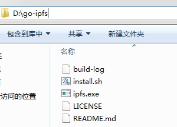
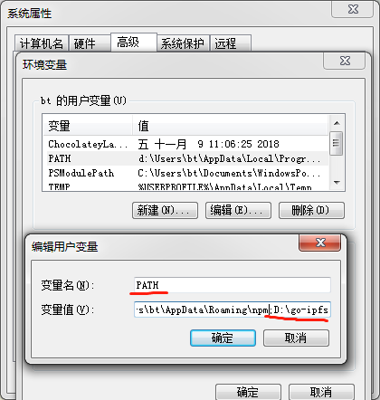
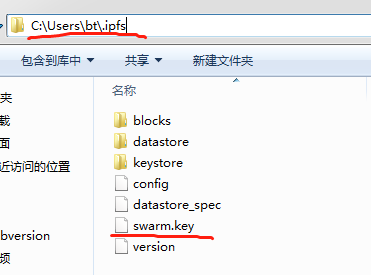

# IPFS 安装

## 环境要求

- 系统: windows 或 linux 都可
- 内存: 16GB+
- 硬盘: 500GB+

## IPFS 安装

### 1.获取文件安装

前往 IPFS 官网下载对应系统的安装文件（需翻墙）:[https://dist.ipfs.io/#go-ipfs](https://dist.ipfs.io/#go-ipfs)

### 2.安装

#### 1.Windows

##### 1.将安装文件解压，然后双击 ipfs.exe。



##### 2.将文件路径加入环境变量 path 中。



#### 2.Linux

##### 1.解压

```bash
tar xvfz go-ipfs_v0.4.15_linux-amd64.tar.gz
```

##### 2.配置环境

```bash
cd go-ipfs
#作用是 把 ./ipfs 移动到 /usr/local/bin 文件夹
./install.sh
```

#### 3.验证是否成功安装

在任何地方都能运行下面的命令（windows 版打开命令窗口 cmd 执行命令）。表示安装成功。

```bash
ipfs help
```

## 启动 IPFS 节点并加入私链

### 1.初始化节点

```bash
ipfs init
```

### 2.移除所有默认的 bootstrap 节点

```bash
ipfs bootstrap rm –all
```

### 3.添加私链节点

```bash
ipfs bootstrap add /ip4/119.3.15.140/tcp/4001/ipfs/QmeDwr8nqLvk1ZJv5XTW2HbuybECFAHRPiKxKpH5oc8Nbe
```

### 4.添加凭证

将[swarm.key](http://misnetwork.io/assets/lib/swarm.key)文件放在 `.ipfs`文件夹里。（windows 版.ipfs 文件夹在用户目录下，liunx 版在 root 目录下）



### 5.启动节点

```bash
ipfs daemon
```

### 6.验证是否成功

```bash
ipfs cat QmZA38zqh2AFjJzSZ1EMDv18THJmWZ5eXKs8w2KFtRUMdT
```


