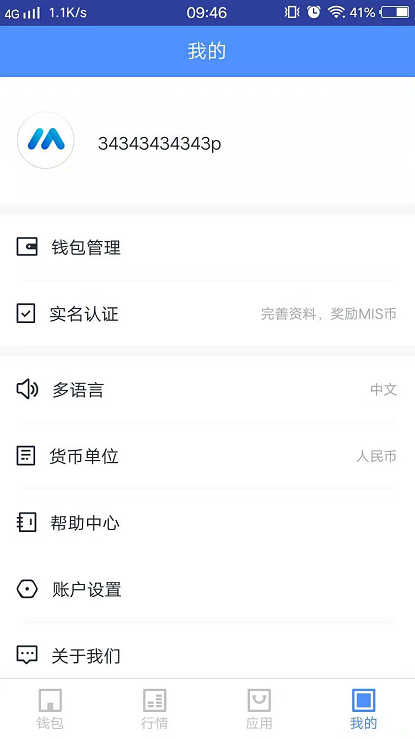
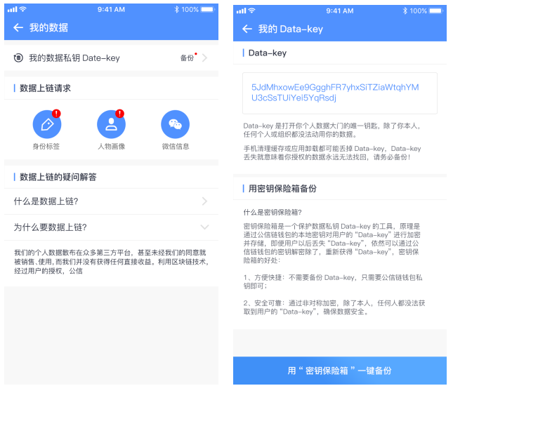
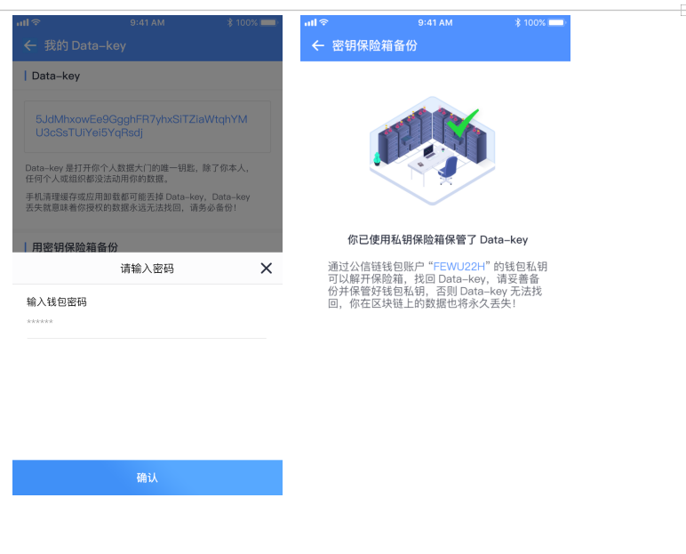
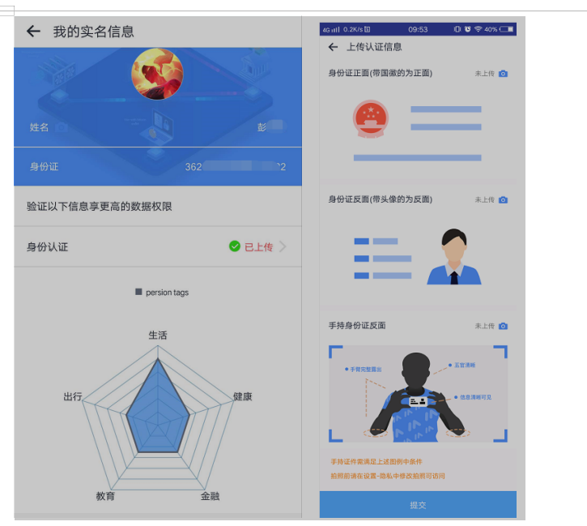
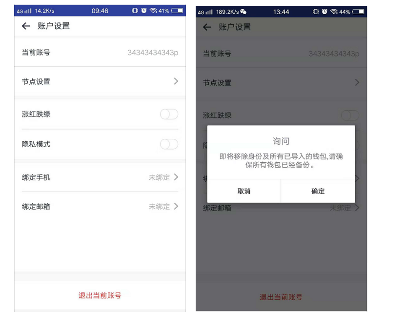
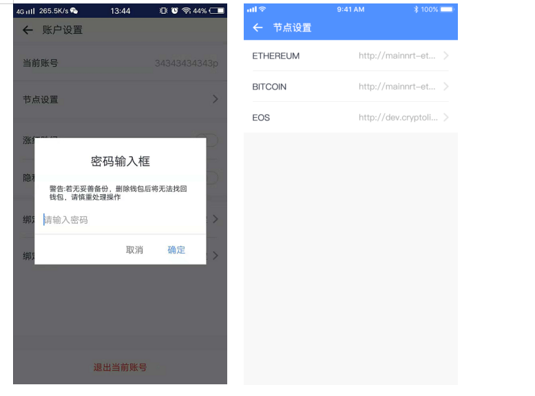
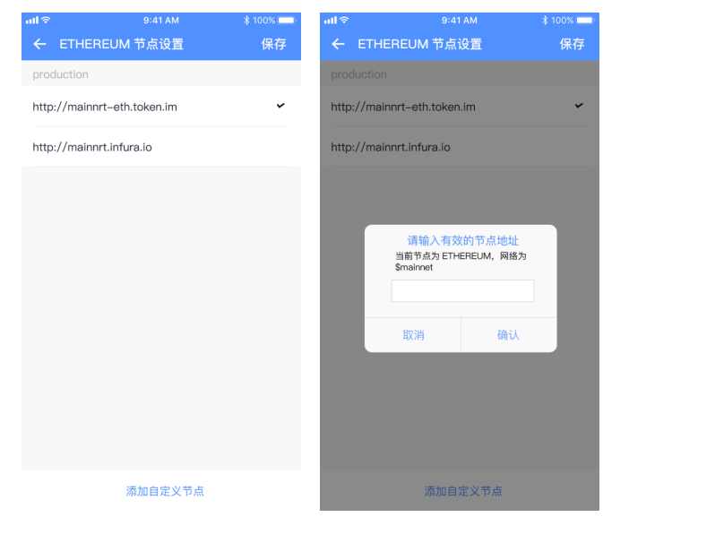

# 个人中心

## 个人中心首页

| 前置条件 | 用户登录成功               |
| :------- | :------------------------- |
| 触发事件 | 登录注册                   |
| 成功场景 | 展示相应的页面             |
| 错误场景 | 操作失败，系统给出失败原因 |
| 功能说明 | 用户个人信息的管理         |
| 操作者   | 所有用户                   |

UI示意图：个人中心界面

> 界面元素------输入及按钮

<table>
    <tr>
        <th>名称</th>
        <th>规则</th>
    </tr>
    <tr>
        <th>个人信息</th>
        <th style="text-align:left;">
             展示用户的个人信息（个人数据、钱包管理、实名认证、节点设置、多语言、货币单位、帮助中心、账户设置 、关于我们）
        </th>
    </tr>
</table>

## 我的数据

| 前置条件 | 用户登录及上传信息         |
| :------- | :------------------------- |
| 触发事件 | 点击个人数据进入           |
| 成功场景 | 展示相应的页面             |
| 错误场景 | 操作失败，系统给出失败原因 |
| 功能说明 | 通过完善信息获得相应的标签 |
| 操作者   | 所有用户                   |

UI示意图：个人数据标签界面

> 界面元素------输入及按钮

<table>
    <tr>
        <th>名称</th>
        <th>规则</th>
    </tr>
    <tr>
        <th>备份数据私钥</th>
        <th>
             <ul style="text-align:left;">
                <li>用户备份个人的Data-Key，需先通过微信信息授权、人物画像上传（个人身份认证）</li>
                <li>用户进入我的数据页面，点击备份，可查看用户个人的Data-Key，点击“用密钥保险箱一键备份”，输入钱包密码，进入密钥保险箱页面，点击“一键备份”即可，确保个人信息的隐密性。若用户未进行微信信息授权、人物画像上传操作，点击备份时跳转微信授权界面</li>
                <li>新用户未进行数据私钥备份，系统给出“红点”提示，未进行数据上链请求操作红色图标提示</li>
            </ul>
        </th>
    </tr>
    <tr>
        <th>数据上链请求</th>
        <th>
             <ul style="text-align:left;">
                <li>用户完成微信信息、人物画像数据上传操作，个人身份标签系统自动完善</li>
                <li>用户点击人物画像，进入上传认证信息界面，上传图片数据（手机设置为允许访问状态），点击提交</li>
                <li>用户进行点击微信信息进行授权操作</li>
            </ul>
        </th>
    </tr>
    <tr>
        <th>关于数据上链</th>
        <th style="text-align:left;">
             用户可通过查看数据上链的问题解释，更有效的了解数据上链信息
        </th>
    </tr>
</table>

## 钱包管理

| 前置条件 | 用户登录账户                     |
| :------- | :------------------------------- |
| 触发事件 | 点击钱包管理按钮                 |
| 成功场景 | 展示相应的页面                   |
| 错误场景 | 操作失败，系统给出失败原因       |
| 功能说明 | 钱包管理列表以及对钱包操作的展示 |
| 操作者   | 所有用户                         |

> 界面元素------输入及按钮

<table>
    <tr>
        <th>名称</th>
        <th>规则</th>
    </tr>
    <tr>
        <th>钱包管理</th>
        <th style="text-align:left;">
             用户点击钱包管理，可对用户个人所属钱包进行导入/导出/删除当操作，详情可见【钱包功能-钱包管理】
        </th>
    </tr>
</table>

## 帮助中心

| 前置条件 | 用户登录账户               |
| :------- | :------------------------- |
| 触发事件 | 点击帮助中心按钮           |
| 成功场景 | 展示相应的页面             |
| 错误场景 | 操作失败，系统给出失败原因 |
| 功能说明 | 为用户提供操作问题解答     |
| 操作者   | 所有用户                   |

> 界面元素------输入及按钮

<table>
    <tr>
        <th>名称</th>
        <th>规则</th>
    </tr>
    <tr>
        <th>搜索帮助</th>
        <th style="text-align:left;">
            用户可通过关键字搜素或问题搜索查找改操作的解决方法
        </th>
    </tr>
     <tr>
        <th>不同类型问题解答</th>
        <th style="text-align:left;">
            用户根据不同问题类型的查找相关的解决方案,问题类型主要包括
        </th>
    </tr>
     <tr>
        <th>联系我们</th>
        <th style="text-align:left;">
            用户遇到问题帮助中心无法解决可联系客服
        </th>
    </tr>
</table>

## 实名认证

| 前置条件 | 用户登录                   |
| :------- | :------------------------- |
| 触发事件 | 点击实名认证进入           |
| 成功场景 | 展示相应的页面             |
| 错误场景 | 操作失败，系统给出失败原因 |
| 功能说明 | 用户进行实名认证           |
| 操作者   | 所有用户                   |

UI示意图：实名认证界面

> 界面元素------输入及按钮

<table>
    <tr>
        <th>名称</th>
        <th>规则</th>
    </tr>
    <tr>
        <th>身份认证</th>
        <th>
             <ul style="text-align:left;">
                <li>新用户未进行身份验证时，可点击身份认证，上传图片数据， 点击提交 ，第三方认证比对成功后，实名信息中的姓名与身份证号系统自动填充；比对失败用户须重新上传图片数据</li>
                <li>完善实名认证信息，可获得MIS币奖励</li>
            </ul>
        </th>
    </tr>
    <tr>
        <th>个人标签</th>
        <th>
             <ul style="text-align:left;">
                <li>用户个人数据分析图</li>
                <li>个人标签的数据分布展示需绑定手机号成功</li>
            </ul>
        </th>
    </tr>
    <tr>
        <th></th>
        <th>
             <ul style="text-align:left;">
                <li>身份认证状态：未验证、失败、验证通过</li>
                <li>未进行图片上传操作，姓名与身份证号为未知状态</li>
                <li>用户验证通过，上传身份信息页不能点击进入</li>
                <li>用户需创建钱包才能进行实名认证操作</li>
            </ul>
        </th>
    </tr>
</table>

## 多语言

| 概述     | 用户的个人设置                  |
| :------- | :------------------------------ |
| 前置条件 | 无                              |
| 触发事件 | 点击个人中心进入                |
| 成功场景 | 展示相应的页面                  |
| 错误场景 | 操作失败，系统给出失败原因      |
| 功能说明 | 用户可通过设置开通过体验app功能 |
| 操作者   | 所有用户                        |

> 界面元素------输入及按钮

<table>
    <tr>
        <th>名称</th>
        <th>规则</th>
    </tr>
    <tr>
        <th>语言切换</th>
        <th style="text-align:left;">
            用于可对app语言进行中/英文切换
        </th>
    </tr>
</table>

## 货币单位

| 概述     | 用户的个人设置                  |
| :------- | :------------------------------ |
| 前置条件 | 无                              |
| 触发事件 | 点击个人中心进入                |
| 成功场景 | 展示相应的页面                  |
| 错误场景 | 操作失败，系统给出失败原因      |
| 功能说明 | 用户可通过设置开通过体验app功能 |
| 操作者   | 所有用户                        |

> 界面元素------输入及按钮

<table>
    <tr>
        <th>名称</th>
        <th>规则</th>
    </tr>
    <tr>
        <th>货币单位选择</th>
        <th style="text-align:left;">
            可选择货币单位（CNY/USD）
        </th>
    </tr>
</table>

## 账户设置

| 概述     | 用户的个人设置                  |
| :------- | :------------------------------ |
| 前置条件 | 用户登录                        |
| 触发事件 | 点击设置进入                    |
| 成功场景 | 展示相应的页面                  |
| 错误场景 | 操作失败，系统给出失败原因      |
| 功能说明 | 用户可通过设置开通过体验app功能 |
| 操作者   | 所有用户                        |

UI示意图：设置界面

> 界面元素------输入及按钮

<table>
    <tr>
        <th>名称</th>
        <th>规则</th>
    </tr>
    <tr>
        <th>节点设置</th>
        <th style="text-align:left;">
            添加不同币种的自定义节点地址
        </th>
    </tr>
     <tr>
        <th>涨红跌绿</th>
        <th style="text-align:left;">
            用户可根据个人使用模式切换配置，系统默认显示为跌红涨绿模式
        </th>
    </tr>
     <tr>
        <th>隐藏模式</th>
        <th>
             <ul style="text-align:left;">
                隐藏开关量，隐藏模式下，用户点击钱包菜单的资产、金额进行隐藏操作
            </ul>
        </th>
    </tr>
    <tr>
        <th>手机绑定</th>
        <th>
             <ul style="text-align:left;">
                <li>绑定用户手机号，用户可使用手机号作为帐号进行登录操作</li>
                <li>用户可使用绑定手机找回账户密码</li>
                <li>一个手机号只可绑定一个钱包用户</li>
            </ul>
        </th>
    </tr>
     <tr>
        <th>邮箱绑定</th>
        <th>
             <ul style="text-align:left;">
                <li>绑定用户手机号，用户可使用邮箱作为帐号进行登录操作励</li>
                <li>用户可使用绑定邮箱找回账户密码</li>
                <li>一个手机号只可绑定一个钱包用户</li>
            </ul>
        </th>
    </tr>
     <tr>
        <th>关于我们</th>
        <th style="text-align:left;">
            查看钱包相关的版本信息
        </th>
    </tr>
     <tr>
        <th>退出登录</th>
        <th style="text-align:left;">
            用户点击退出登录，重新打开APP需使用账户名+密码进行登录操作；用户直接关闭app而未退出，则可直接进入APP无需登录
        </th>
    </tr>
</table>