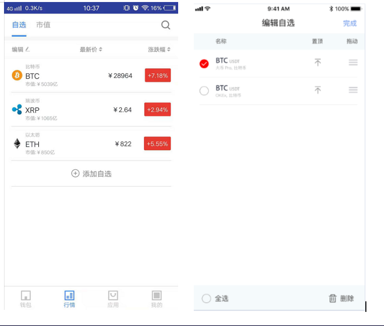
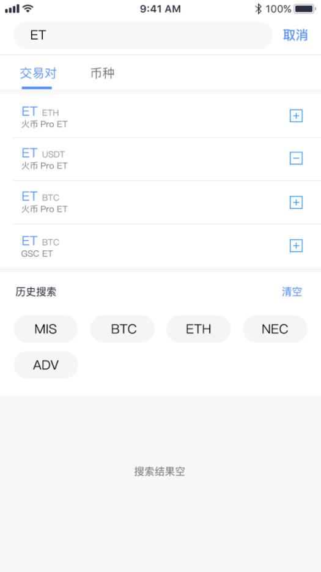
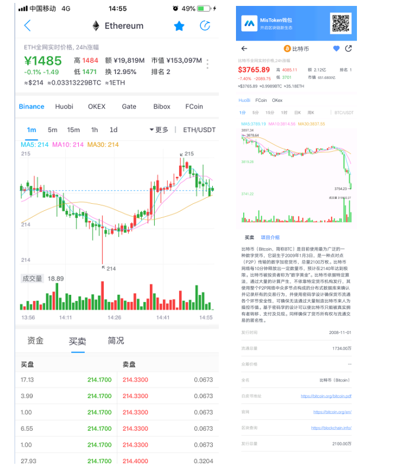

# 行情

## 自选

| 前置条件 | 所有                                       |
| :------- | :----------------------------------------- |
| 触发事件 | 点击加入自选按钮                           |
| 成功场景 | 自选界面拥有该交易对                       |
| 错误场景 | 操作失败，系统给出失败原因                 |
| 功能说明 | 用户可将个人关注的各种交易对添加至自选列表 |
| 操作者   | 所有用户                                   |

UI示意图：自选界面

> 界面元素------输入及按钮

<table>
    <tr>
        <th>名称</th>
        <th>规则</th>
    </tr>
    <tr>
        <th>自选</th>
        <th>
             <ul style="text-align:left;">
                <li>页面展示用户所添加的所有交易对信息列表</li>
                <li>币种相应的市场价值/市值/涨跌幅为实时更新，用户可查看最新数据</li>
                <li>点击任意自选交易对，可查看该交易对走势详情</li>
            </ul>
        </th>
    </tr>
    <tr>
        <th>编辑自选</th>
        <th style="text-align:left;">
             用户可将已添加的交易对进行删除（全选/单选）、拖动排序、置顶操作，点击“完成”保存即可
        </th>
    </tr>
    <tr>
        <th>添加自选</th>
        <th style="text-align:left;">
           用户点击添加自选按钮，输入币种名称/交易对，选择添加所需要的币种或交易对
        </th>
    </tr>
     <tr>
        <th>搜索</th>
        <th style="text-align:left;">
            点击所搜按钮，跳转搜索页面，操作详情可见【搜索】
        </th>
    </tr>
</table>

## 市值

| 前置条件 | 无                           |
| :------- | :--------------------------- |
| 触发事件 | 点击市值tab选项卡            |
| 成功场景 | 展示相应的页面               |
| 错误场景 | 操作失败，系统给出失败原因   |
| 功能说明 | 主要展示不同币种按照市值排序 |
| 操作者   | 所有用户                     |

UI示意图：市值排序界面

> 界面元素------输入及按钮

<table>
    <tr>
        <th>名称</th>
        <th>规则</th>
    </tr>
    <tr>
        <th>查看市值</th>
        <th style="text-align:left;">
            用户可查看不同币种的市场价值与今日涨跌幅，页面展示所有的币种排序，根据价值由高到低排列
        </th>
    </tr>
    <tr>
        <th>搜索</th>
        <th style="text-align:left;">
           用户点击搜索按钮，查询相关币种的价值详情
        </th>
    </tr>
</table>

## 搜索

| 概述     | 可以搜索交易对                   |
| :------- | :------------------------------- |
| 前置条件 | 无                               |
| 触发事件 | 点击搜索进入                     |
| 成功场景 | 展示相应的页面                   |
| 错误场景 | 操作失败，系统给出失败原因       |
| 功能说明 | 提供用户搜索查看交易对与币种信息 |
| 操作者   | 所有用户                         |

UI示意图：搜索界面

> 界面元素------输入及按钮

<table>
    <tr>
        <th>名称</th>
        <th>规则</th>
    </tr>
    <tr>
        <th>输入</th>
        <th>
             <ul style="text-align:left;">
                <li>用户需输入交易对/币种进行搜索</li>
                <li>用户查询输入错误时，页面信息提示“搜索结果为空”</li>
            </ul>
        </th>
    </tr>
    <tr>
        <th>移出/添加自选</th>
        <th style="text-align:left;">
            用户选择搜索的交易对或币种进行移出/添加操作，“-”表示自选列表已添加该交易对/币种，再次点击为移出操作，则自选列表不显示已取消的交易对/币种，“+”表示添加交易对/币种
        </th>
    </tr>
    <tr>
        <th>查看详情</th>
        <th style="text-align:left;">
           选择任意搜索的交易对/币种，可查看走势详情
        </th>
    </tr>
    <tr>
        <th>历史记录</th>
        <th>
             <ul style="text-align:left;">
                <li>展示用户输入搜索交易对/币种的历史记录，同时用户可对历史搜索记录进行清空操作</li>
                <li>历史记录列表展示最新的20条记录</li>
            </ul>
        </th>
    </tr>
</table>

## 交易对详情

| 前置条件 | 无                         |
| :------- | :------------------------- |
| 触发事件 | 点击交易对进入             |
| 成功场景 | 展示相应的页面             |
| 错误场景 | 操作失败，系统给出失败原因 |
| 功能说明 | 查看交易对详情             |
| 操作者   | 所有用户                   |

UI示意图：详情界面

> 界面元素------输入及按钮

<table>
    <tr>
        <th>名称</th>
        <th>规则</th>
    </tr>
    <tr>
        <th>K线图</th>
        <th style="text-align:left;">
            根据不同时间间隔对交易对详情进行K线图展示 
            k线图数据获取来源于不同的交易所 ：HuoBi/FCoin/OKex
        </th>
    </tr>
    <tr>
        <th>币种数据显示</th>
        <th style="text-align:left;">
           展示相应的币种实时价格/排名/市值
        </th>
    </tr>
     <tr>
        <th>币种介绍</th>
        <th style="text-align:left;">
            展示币种的概述
        </th>
    </tr>
    <tr>
        <th>买卖深度</th>
        <th style="text-align:left;">
           展示当前币种买卖的挂单信息
        </th>
    </tr>
     <tr>
        <th>收藏交易对</th>
        <th style="text-align:left;">
            用户点击收藏添加按钮，可将该交易对添加至自选交易对列表
        </th>
    </tr>
    <tr>
        <th>分享</th>
        <th>
             <ul style="text-align:left;">
                <li>用户点击单击分享图标，选择分享方式</li>
                <li>用户对交易对详情信息截图分享，系统自动附带Mission钱包应用二维码，方便用户了解更多的钱包应用详情</li>
            </ul>
        </th>
    </tr>
</table>
