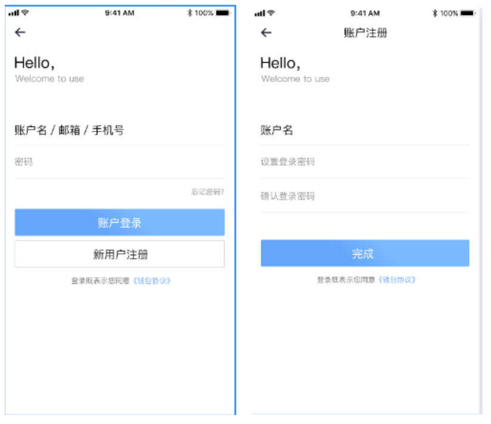
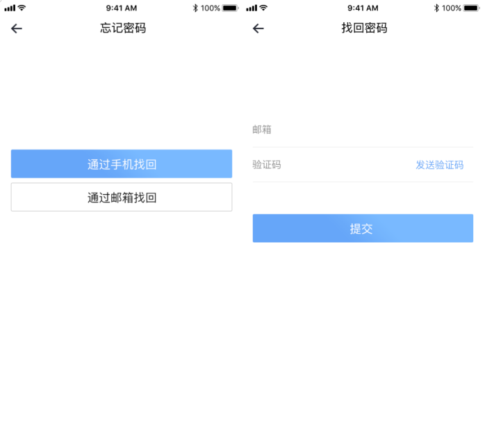
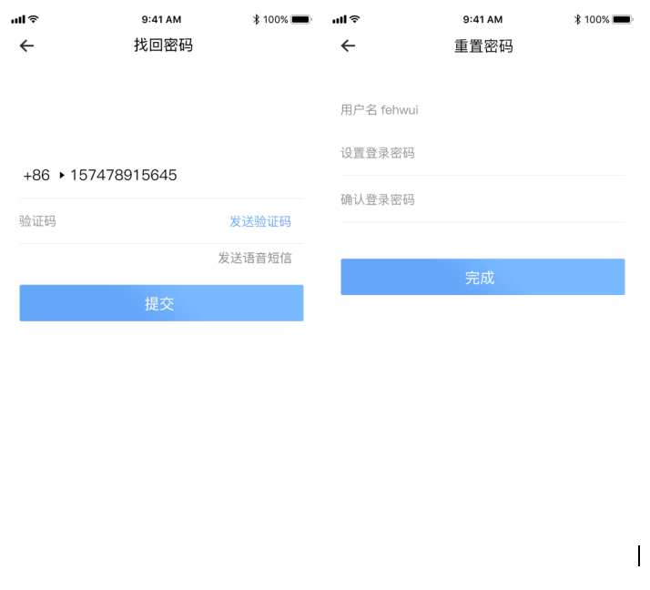

# 登录注册

| 前置条件 | 用户注册/登录              |
| :------- | :------------------------- |
| 触发事件 | 查看用户信息               |
| 成功场景 | 展示相应的页面             |
| 错误场景 | 操作失败，系统给出失败原因 |
| 功能说明 | 用户登录/注册APP操作       |
| 操作者   | 所有用户                   |

UI示意图：登录注册界面

> 界面元素------输入及按钮

<table>
    <tr>
        <th>名称</th>
        <th>规则</th>
    </tr>
    <tr>
        <th>登录</th>
        <th>
            <ul style="text-align:left;">
                <li>用户登录APP可使用自定义账户名，手机号，邮箱三种方式进行登录操作</li>
                <li>使用手机号、邮箱作为账户名登录时用户须提前绑定成功</li>
                <li>登录密码为不同登录方式的通用密码</li>
                <li>用户在无注销的的情况下，退出app，再次打开时不需要重新登录，如已注销的则需重新登录</li>
            </ul>
        </th>
    </tr>
    <tr>
        <th>新用户注册</th>
        <th>
            <ul style="text-align:left;">
                <li>未注册用户点击“新用户注册”按钮，进入账户注册页输入钱包app的登录自定义账户名与密码，点击“完成”</li>
                <li>新用户注册完成进入钱包首页进行创建钱包/导入钱包操作，或点击导航菜单“我的”进入个人中心查看账户信息，未创建钱包用户需返回创建钱包/导入钱包操作可点击导航菜单“钱包即可</li>
            </ul>
        </th>
    </tr>
     <tr>
        <th>忘记密码</th>
        <th>
            <ul style="text-align:left;">
                <li>用户进行忘记密码操作，可通过手机号、邮箱找回重置，手动输入邮箱/手机号接收验证码</li>
                <li>用户可选择验证码接收方式：手机验证码</li>
                <li>重置密码后，用户需使用新密码重新登录钱包APP</li>
            </ul>
        </th>
    </tr>
</table>
