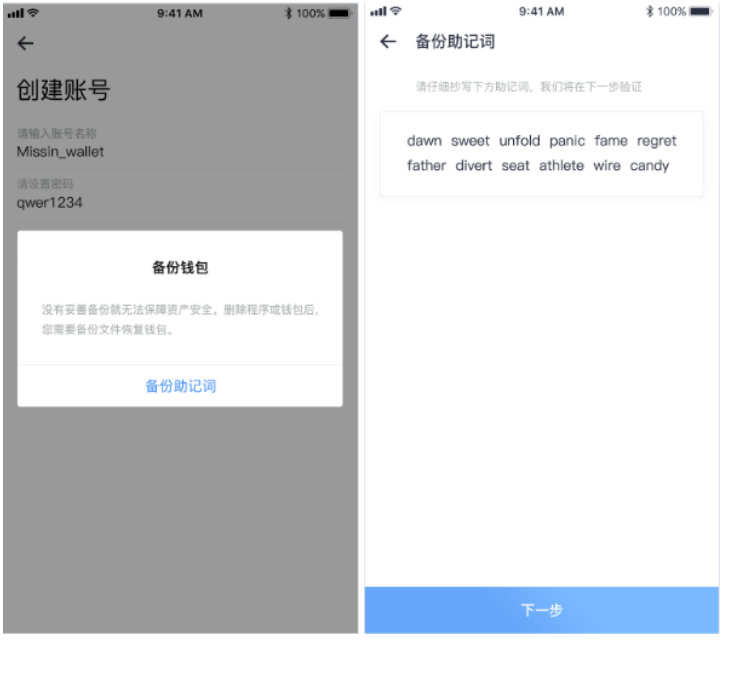
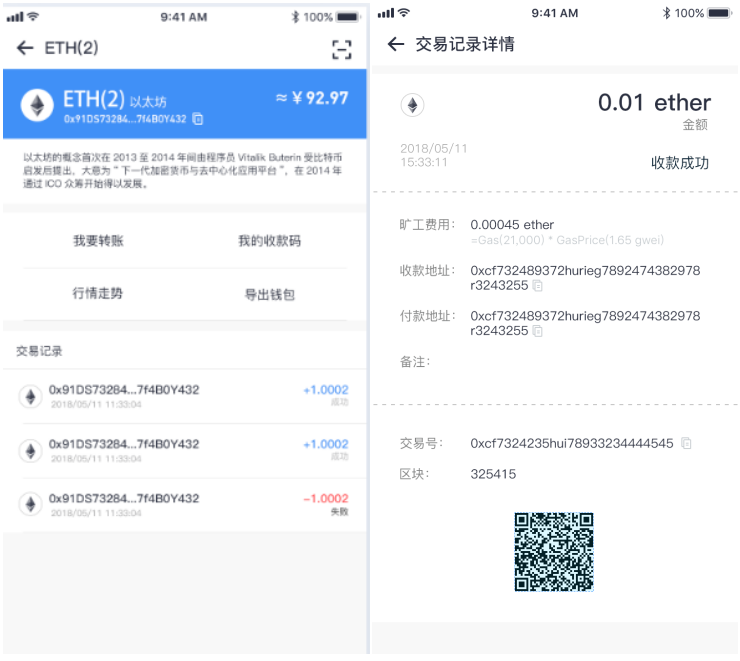
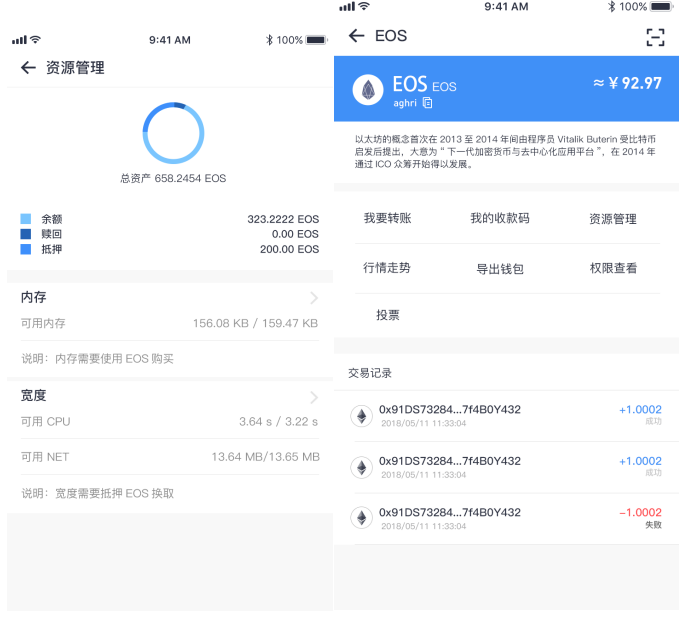
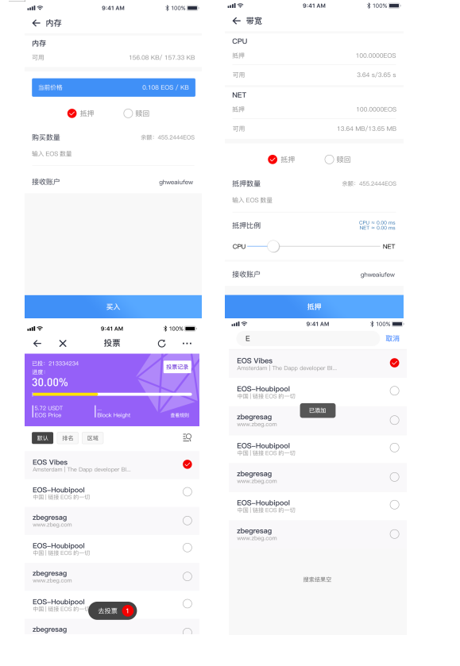
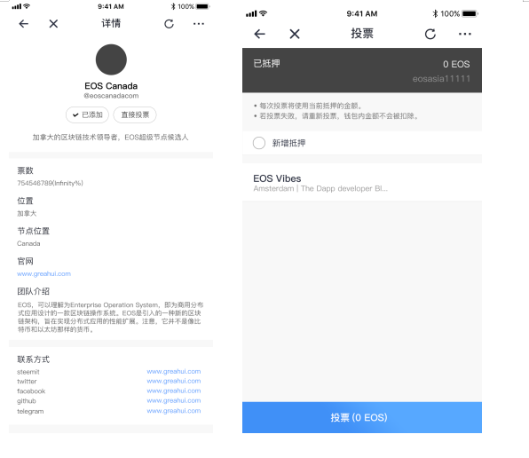
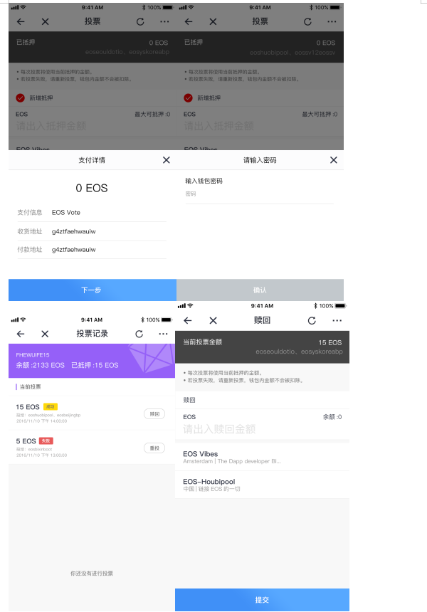

# 钱包功能

> 功能清单

<table>
    <tbody>
        <tr>
            <th>功能</th>
            <th>子功能</th>
            <th>功能描述</th>
        </tr>
        <tr>
            <th rowspan="2">钱包</th>
            <th>资产概览</th>
            <td>资产总额、今日收益、今日涨幅、钱包管理（创建、导出、查询交易记录、转账、收款）</td>
        </tr>
        <tr>
            <th>资产列表</th>
            <td>BTC、ETH、EOS、MIS、试用币的基本详情数据</td>
        </tr>
        <tr>
            <th rowspan="2">应用</th>
            <th>魔力试用</th>
            <td>试用商城</td>
        </tr>
        <tr>
            <th>区块链浏览器</th>
            <td>区块链浏览器</td>
        </tr>
        <tr>
            <th rowspan="5">行情</th>
            <th>自选交易对</th>
            <td>自选交易对的数据展示（数据来源火币交易所）</td>
        </tr>
        <tr>
            <th>交易对列表</th>
            <td>基于火币交易所的所有交易对按照不同的基准值进行数据展示及不同条件的排序</td>
        </tr>
        <tr>
            <th>搜索</th>
            <td>用于搜索火币交易所的所有币种，以便查看</td>
        </tr>
         <tr>
            <th>综合</th>
            <td>基于火币交易所的所有币种，进行不同维度的数据分析，以便用户查看和对比</td>
        </tr>
        <tr>
            <th>交易对详情</th>
            <td>根据交易对获取主币种的基础数据、币种介绍、数据分析、买卖挂单及不同维度的K线图展示</td>
        </tr>
        <tr>
            <th rowspan="9">个人中心</th>
            <th>用户登录注册</th>
            <td>用户的注册和登录</td>
        </tr>
        <tr>
            <th>账户设置</th>
            <td>当前帐号显示、手机号绑定、邮箱绑定、隐私设置、涨红跌绿设置，节点设置，退出账号</td>
        </tr>
        <tr>
            <th>个人数据标签</th>
            <td>备份Data-Key、微信授权、上传用户身份证信息</td>
        </tr>
        <tr>
            <th>实名认证</th>
            <td>上传身份进行认证（奖励mis币）</td>
        </tr>
        <tr>
            <th>钱包管理</th>
            <td>钱包创建、导出、查询交易记录、转账、收款</td>
        </tr>
        <tr>
            <th>多语言</th>
            <td>语言模式切换（中/英文）</td>
        </tr>
        <tr>
            <th>货币单位</th>
            <td>货币单位切换选择（人民币/美元）</td>
        </tr>
        <tr>
            <th>帮助中心</th>
            <td>用户问题解答、联系我们</td>
        </tr>
        <tr>
            <th>关于我们</th>
            <td>应用版本信息</td>
        </tr>
    </tbody>
</table>

## 钱包

## 资产概述

| 前置条件 | 用户已经登录                                     |
| :------- | :----------------------------------------------- |
| 触发事件 | 用户点击钱包导航栏                               |
| 错误场景 | 报错或者直接提示登录                             |
| 功能说明 | 该功能主要提供用户管理个人钱包资产，查看钱包收益 |
| 操作者   | 所有用户                                         |

UI示意图：钱包菜单

> 界面元素------输入

<table>
    <tr>
        <th>名称</th>
        <th>规则</th>
    </tr>
    <tr>
        <th>资产金额</th>
        <th style="text-align:left;">
            点击资产金额可隐藏或显示用户的资产总额度，确保资产隐密性
            展示资产总金额的今日收益、今日涨跌，方便用户查看资产收益
        </th>
    </tr>
    <tr>
        <th>钱包种类</th>
        <th style="text-align:left;">
           用户可根据钱包种类查看不同类型的钱包额度
        </th>
    </tr>
     <tr>
        <th>钱包管理</th>
        <th style="text-align:left;">
            跳转到钱包管理页面，可对个人钱包进行导出操作
        </th>
    </tr>
    <tr>
        <th>导入新钱包</th>
        <th style="text-align:left;">
            用户可通过不同的方式，导入用户其他的所属钱包，方便用户进行统一管理，导入操作详情可见【导入钱包】
            例如：MIS钱包（助记词、私钥）、BTC（助记词、私钥）、ETH（Keystore、助记词、私钥）、EOS钱包（私钥、ETH私钥）
        </th>
    </tr>
    <tr>
        <th>收款码</th>
        <th style="text-align:left;">
           显示用户的收款信息二维码（收款钱包默认为MIS_wallet）
        </th>
    </tr>
     <tr>
        <th>扫描转账</th>
        <th style="text-align:left;">
            用户间的扫描转账功能（手机设置为允许访问状态下），用户点击扫描按钮，识别收款码类型，跳转相应钱包的转账页面
        </th>
    </tr>
     <tr>
        <th></th>
        <th>
             <ul style="text-align:left;">
                <li>用户可以导入多个相同币种的钱包，管理钱包中同种类型具有序号标注</li>
                <li>币种分类：MIS/DAPP/其他（其他分类包括除MIS/DAPP之外所有第三方数字币种）</li>
                <li>钱包额度为所有钱包额度的总和</li>
                <li>钱包首页列表中分类展示当前身份下创建的钱包、手工导入钱包</li>
                <li>用户退出当前钱包时，重新登录使用钱包需从新导入当前用户身份的钱包</li>
            </ul>
        </th>
    </tr>
</table>

## 创建钱包

| 前置条件 | 用户已经登录               |
| :------- | :------------------------- |
| 触发事件 | 点击创建钱包按钮           |
| 成功场景 | 展示相应的页面             |
| 错误场景 | 操作失败，系统给出失败原因 |
| 功能说明 | 用户创建新钱包功能         |
| 操作者   | 所有用户                   |

UI示意图：创建钱包、备份助记词界面

> 界面元素------输入

<table>
    <tr>
        <th>名称</th>
        <th>规则</th>
    </tr>
    <tr>
        <th>钱包名称与密码</th>
        <th style="text-align:left;">
            新用户输入密码并确认即可创建钱包，钱包名称默认填充为用户注册APP时输入的账户名
        </th>
    </tr>
    <tr>
        <th>备份助记词</th>
        <th style="text-align:left;">
           用户将系统生成的备份助记词按顺序抄写备份，完成点击“下一步”，进行二次验证
        </th>
    </tr>
     <tr>
        <th>确认助记词</th>
        <th style="text-align:left;">
            用户在二次确认助记词时，按顺序点击填入助记词，确保正确备份
        </th>
    </tr>
     <tr>
        <th></th>
        <th>
             <ul style="text-align:left;">
                <li>助记词在移除之前一定要确保已正确备份，移除之后，当前钱包已经没有助记词但是用户可以通过导入助记词功能重新导入</li>
                <li>备份助记词尽可能不要采用截屏或者拍照，尽可能采用物理介质备份，例如用笔抄写等方式，以防遗漏丢失。</li>
                <li>新用户创建钱包时系统默认创建4种类型钱包：Mission钱包/比特币钱包/以太坊钱包/EOS钱包，钱包密码为用户创建钱包时统一设置的密码</li>
                <li>用户创建钱包备份助记词，该助记词通用于系统默认创建的钱包</li>
                <li>用户注册app时输入的账户名为钱包名称，同时默认为MIS钱包地址</li>
                <li>系统默认创建EOS钱包为未注册状态，用户需在钱包管理中对该钱包完成注册操作，详情可见【钱包管理--注册EOS账户】</li>
            </ul>
        </th>
    </tr>
</table>

## 钱包详情

| 前置条件 | 用户已经创建或者导入过钱包                                                         |
| :------- | :--------------------------------------------------------------------------------- |
| 触发事件 | 用户点击相应钱包进入                                                               |
| 成功场景 | 用户进入相应的页面                                                                 |
| 错误场景 | 用户无法进入相应的页面                                                             |
| 功能说明 | 该功能主要是钱包的概述以及用户对钱包的操作（转账、收款、行情、导出、查看交易记录） |
| 操作者   | 所有用户                                                                           |

UI示意图：钱包详情

> 界面元素------输入

<table>
    <tr>
        <th>名称</th>
        <th>规则</th>
    </tr>
    <tr>
        <th>钱包地址复制</th>
        <th style="text-align:left;">
            用户可复制转发钱包地址进行转账操作
        </th>
    </tr>
    <tr>
        <th>扫描转账</th>
        <th style="text-align:left;">
           用户通过扫描二维码获取收款地址进行转账操作
        </th>
    </tr>
     <tr>
        <th>转账</th>
        <th style="text-align:left;">
            进入转账界面
        </th>
    </tr>
    <tr>
        <th>收款</th>
        <th style="text-align:left;">
           进入收款界面（二维码）
        </th>
    </tr>
     <tr>
        <th>行情走势</th>
        <th style="text-align:left;">
            进入用户所选币种的行情详情页，方便用户查看以所选币种为基础的所有交易对走势与涨跌幅度
            例如：所选币种为ETH(2)，用户可查看到交易对RCC/ETH、XRP/ETH、XRP/ETH等以ETH为基础的交易对走势与涨跌幅度
        </th>
    </tr>
    <tr>
        <th>导出钱包</th>
        <th style="text-align:left;">
            进入钱包导出页面，不同钱包类型可选择不同的导出方式
            例如：MIS钱包（助记词/私钥）、BTC钱包（助记词/私钥）、ETH钱包（keystore/助记词/私钥）、EOS钱包（私钥）等
        </th>
    </tr>
     <tr>
        <th>交易记录</th>
        <th>
             <ul style="text-align:left;">
                <li>展示该币种的所有的交易记录，点击某一交易记录可查看交易详情</li>
                <li>用户选择点击任意交易记录，可查看该交易的详情（金额、交易状态、交易时间、矿工费用，地址）</li>
                <li>交易详情二维码，用户可通过扫描识别二维码即可获得该次交易详情</li>
                <li>显示用户的所有交易记录（转出、转入、失败），”红色“表示转出；”蓝色“表示转入</li>
            </ul>
        </th>
    </tr>
    <tr>
        <th>资源管理(EOS)</th>
        <th>
             <ul style="text-align:left;">
                <li>资源管理包括内存、带宽（CPU/NET）</li>
                <li>EOS总资产的分布状态：余额、赎回、抵押</li>
                <li>用户创建EOS账户需增加EOS内存存储空间，确保可以随时存储、修改数据，则需用户使用EOS在其系统中购买，购买时用户输入购买数量，选择操作类型（抵押），店家买入支付即可，成功完成后EOS内存增加；用户不需要内存时可将多余内存卖给系统，赎回相应的EOS代币</li>
                <li>EOS带宽包括CPU、NET，EOS应用时需占用一定的CPU和NET资源，用户需锁定一定数量的代币抵押换取，用户进入带宽页面，输入抵押数量，滑动选择cpu/net的抵押比例，点击抵押即可，完成后CPU/NET增加；用户不需要占用过多CPU/NET时可其卖出，赎回相应EOS代币</li>
            </ul>
        </th>
    </tr>
    <tr>
        <th>权限查看(EOS)</th>
        <th style="text-align:left;">
           进入权限查看页面，用户可了解EOS账户的权限管理，带有图标“蓝点”的公钥对应的私钥存在于当前钱包，导出钱包时用户可将对应的EOS私钥导出
        </th>
    </tr>
     <tr>
        <th>节点投票(EOS)</th>
        <th>
             <ul style="text-align:left;">
                <li>用户点击界面“钱包”图标，计入投票信息页面用户可看到该用户的EOS钱包的详细信息，包括EOS余额，已抵押的EOS数量（可进行投票的EOS数量），以及当前的投票结果</li>
                <li>用户在已投票详情界面，在主网未启动之前，抵押金无法赎回，当节点的投票达到限定数量，可进行赎回操作，对已投票的节点申请赎回抵押的EOS</li>
                <li>用户点击“查看规则”按钮，进入帮助中心页面，查看投票规则与注意事项</li>
                <li>用户可在节点列表中点击圆圈，选择想要投票的节点，选择成功去投票数量增加，投票列表中显示已添加的节点；同时用户可点击单一的列表项，进入节点详情页，查看该节点的信息与投票</li>
                <li>用户点击节点详情页的“直接投票”按钮，进入投票界面，若用户需要增加抵押金额，需选择新增抵押输入新增金额，点击“投票”按钮，输入钱包密码；同时，用户点击“去投票”，按钮，进入投票界面，可一次性对多个候选节点进行投票</li>
                <li>节点排序（默认/排名/区域），用户进入节点投票界面，节点按照默认排序，三种排序方式手动可切换查看</li>
                <li>候选节点查询，用户点击搜索图标，进入搜索界面，输入节点名称，选择节点查看详情</li>
                <li>投票状态：成功、失败；投票显示失败状态，可重新投票，且金额不会被扣除</li>
                <li>用户点击界面“X”图标，退出投票操作</li>
                <li>用户点击刷新图标，系统对节点排序状态实时更新</li>
                <li>一个EOS可以抵押成1票，一票最多可以同时投30个候选节点，每个候选节点最多投一票</li>
            </ul>
        </th>
    </tr>
    <tr>
        <th></th>
        <th>
             <ul style="text-align:left;">
                <li>钱包详情中可查看用户所持有的钱包兑换成人民币的价值总额</li>
                <li>交易记录的状态：成功、失败</li>
            </ul>
        </th>
    </tr>
</table>