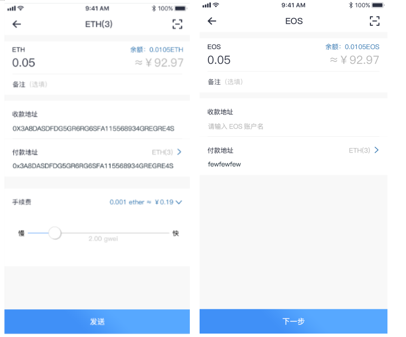
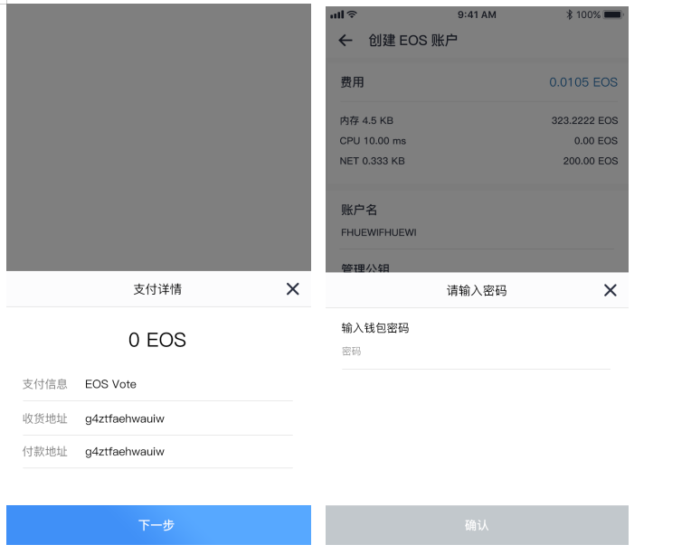
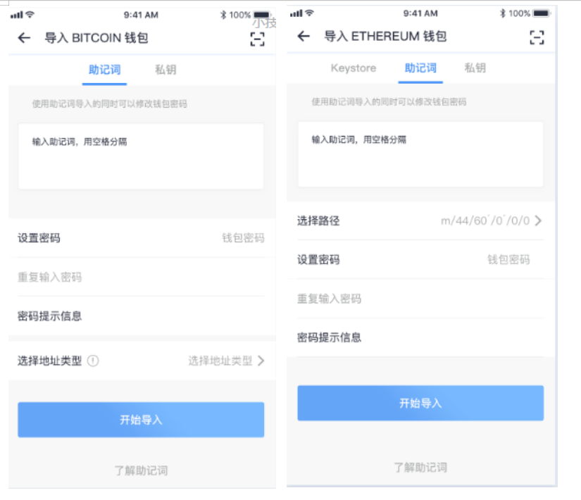
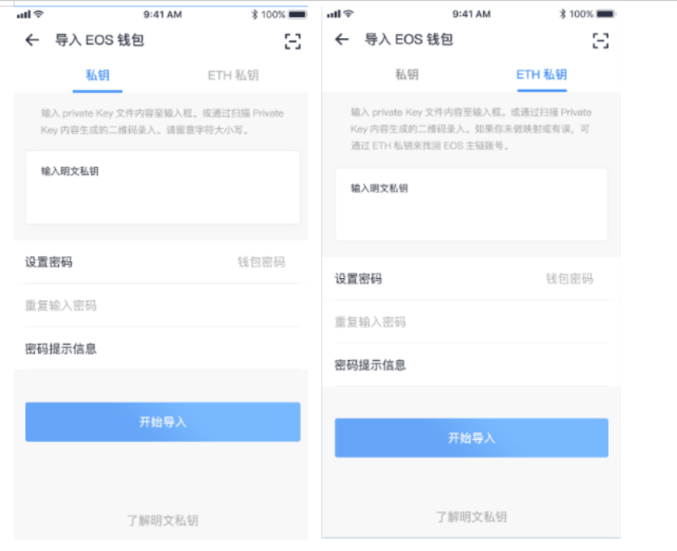
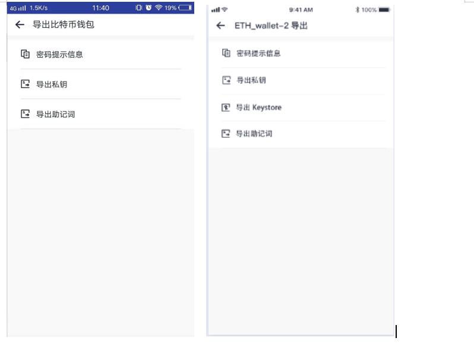

# 钱包功能

> 功能清单

<table>
    <tbody>
        <tr>
            <th>功能</th>
            <th>子功能</th>
            <th>功能描述</th>
        </tr>
        <tr>
            <th rowspan="2">钱包</th>
            <th>资产概览</th>
            <td>资产总额、今日收益、今日涨幅、钱包管理（创建、导出、查询交易记录、转账、收款）</td>
        </tr>
        <tr>
            <th>资产列表</th>
            <td>BTC、ETH、EOS、MIS、试用币的基本详情数据</td>
        </tr>
        <tr>
            <th rowspan="2">应用</th>
            <th>魔力试用</th>
            <td>试用商城</td>
        </tr>
        <tr>
            <th>区块链浏览器</th>
            <td>区块链浏览器</td>
        </tr>
        <tr>
            <th rowspan="4">行情</th>
            <th>自选交易对</th>
            <td>自选交易对的数据展示</td>
        </tr>
        <tr>
            <th>市值</th>
            <td>不同的数字货币按市值高低排列展示</td>
        </tr>
        <tr>
            <th>搜索</th>
            <td>用于搜索交易所的所有币种，以便查看、收藏</td>
        </tr>
        <tr>
            <th>交易对详情</th>
            <td>
                <li>基于HuoBi/FCoin/OKex交易所的所有交易对按照不同的基准值进行数据展示及不同条件的排序（最新价/今日涨跌）</li>
                <li>根据交易对获取币种的基础数据（涨跌幅、最高/低价格、市值、排名、兑换美元/btc/eth价格）、币种介绍、数据分析、买卖挂单、成交量及不同维度的K线图展示</li>
                <li>交易对详情分享</li>
            </td>
        </tr>
        <tr>
            <th rowspan="8">个人中心</th>
            <th>用户登录注册</th>
            <td>用户的注册和登录</td>
        </tr>
        <tr>
            <th>账户设置</th>
            <td>当前帐号显示、手机号绑定、邮箱绑定、隐私设置、涨红跌绿设置，节点设置，退出账号</td>
        </tr>
        <tr>
            <th>实名认证</th>
            <td>
                <li>上传身份进行认证（奖励mis币）</li>
                <li>用户绑定手机号，可查看个人标签（用户个人钱包行为数据分布）</li>
            </td>
        </tr>
        <tr>
            <th>钱包管理</th>
            <td>钱包创建、导出、查询交易记录、转账、收款</td>
        </tr>
        <tr>
            <th>多语言</th>
            <td>语言模式切换（中/英文）</td>
        </tr>
        <tr>
            <th>货币单位</th>
            <td>货币单位切换选择（人民币/美元）</td>
        </tr>
        <tr>
            <th>帮助中心</th>
            <td>用户问题解答、联系我们</td>
        </tr>
        <tr>
            <th>关于我们</th>
            <td>应用版本信息</td>
        </tr>
    </tbody>
</table>

## 钱包

## 资产概述

| 前置条件 | 用户已经登录                                     |
| :------- | :----------------------------------------------- |
| 触发事件 | 用户点击钱包导航栏                               |
| 错误场景 | 报错或者直接提示登录                             |
| 功能说明 | 该功能主要提供用户管理个人钱包资产，查看钱包收益 |
| 操作者   | 所有用户                                         |

UI示意图：钱包菜单

> 界面元素------输入

<table>
    <tr>
        <th>名称</th>
        <th>规则</th>
    </tr>
    <tr>
        <th>资产金额</th>
        <th style="text-align:left;">
            点击资产金额可隐藏或显示用户的资产总额度，确保资产隐密性
            展示资产总金额的今日收益、今日涨跌，方便用户查看资产收益
        </th>
    </tr>
    <tr>
        <th>钱包种类</th>
        <th style="text-align:left;">
           用户可根据钱包种类查看不同类型的钱包额度
        </th>
    </tr>
     <tr>
        <th>钱包管理</th>
        <th style="text-align:left;">
            跳转到钱包管理页面，可对个人钱包进行导出操作
        </th>
    </tr>
    <tr>
        <th>导入新钱包</th>
        <th style="text-align:left;">
            <li>用户可通过不同的方式，导入用户其他的所属钱包，方便用户进行统一管理，导入操作详情可见【导入钱包】
            例如：MIS钱包（助记词、私钥）、BTC（助记词、私钥）、ETH（Keystore、助记词、私钥）、EOS钱包（私钥、ETH私钥）</li>
            <li>用户导入新钱包的个数限制（不同类型钱包导入个数不得超于5个）</li>
        </th>
    </tr>
    <tr>
        <th>收款码</th>
        <th style="text-align:left;">
           显示用户的收款信息二维码（收款钱包默认为MIS_wallet）
        </th>
    </tr>
     <tr>
        <th>扫描转账</th>
        <th style="text-align:left;">
            用户间的扫描转账功能（手机设置为允许访问状态下），用户点击扫描按钮，识别收款码类型，跳转相应钱包的转账页面
        </th>
    </tr>
     <tr>
        <th></th>
        <th>
             <ul style="text-align:left;">
                <li>用户可以导入多个相同币种的钱包，管理钱包中同种类型具有序号标注</li>
                <li>币种分类：MIS/DAPP/其他（其他分类包括除MIS/DAPP之外所有第三方数字币种）</li>
                <li>钱包额度为所有钱包额度的总和</li>
                <li>钱包首页列表中分类展示当前身份下创建的钱包、手工导入钱包</li>
                <li>用户退出当前钱包时，重新登录使用钱包需从新导入当前用户身份的钱包</li>
            </ul>
        </th>
    </tr>
</table>

## 创建钱包

| 前置条件 | 用户已经登录               |
| :------- | :------------------------- |
| 触发事件 | 点击创建钱包按钮           |
| 成功场景 | 展示相应的页面             |
| 错误场景 | 操作失败，系统给出失败原因 |
| 功能说明 | 用户创建新钱包功能         |
| 操作者   | 所有用户                   |

UI示意图：创建钱包、备份助记词界面

> 界面元素------输入

<table>
    <tr>
        <th>名称</th>
        <th>规则</th>
    </tr>
    <tr>
        <th>钱包名称与密码</th>
        <th style="text-align:left;">
            新用户输入密码并确认即可创建钱包，钱包名称默认填充为用户注册APP时输入的账户名
        </th>
    </tr>
    <tr>
        <th>备份助记词</th>
        <th style="text-align:left;">
           用户将系统生成的备份助记词按顺序抄写备份，完成点击“下一步”，进行二次验证
        </th>
    </tr>
     <tr>
        <th>确认助记词</th>
        <th style="text-align:left;">
            用户在二次确认助记词时，按顺序点击填入助记词，确保正确备份
        </th>
    </tr>
     <tr>
        <th></th>
        <th>
             <ul style="text-align:left;">
                <li>助记词在移除之前一定要确保已正确备份，移除之后，当前钱包已经没有助记词但是用户可以通过导入助记词功能重新导入</li>
                <li>备份助记词尽可能不要采用截屏或者拍照，尽可能采用物理介质备份，例如用笔抄写等方式，以防遗漏丢失。</li>
                <li>新用户创建钱包时系统默认创建4种类型钱包：Mission钱包/比特币钱包/以太坊钱包/EOS钱包，钱包密码为用户创建钱包时统一设置的密码</li>
                <li>用户创建钱包备份助记词，该助记词通用于系统默认创建的钱包</li>
                <li>用户注册app时输入的账户名为钱包名称，同时默认为MIS钱包地址</li>
                <li>系统默认创建EOS钱包为未注册状态，用户需在钱包管理中对该钱包完成注册操作，详情可见【钱包管理--注册EOS账户】</li>
            </ul>
        </th>
    </tr>
</table>

## 钱包详情

| 前置条件 | 用户已经创建或者导入过钱包                                                         |
| :------- | :--------------------------------------------------------------------------------- |
| 触发事件 | 用户点击相应钱包进入                                                               |
| 成功场景 | 用户进入相应的页面                                                                 |
| 错误场景 | 用户无法进入相应的页面                                                             |
| 功能说明 | 该功能主要是钱包的概述以及用户对钱包的操作（转账、收款、行情、导出、查看交易记录） |
| 操作者   | 所有用户                                                                           |

UI示意图：钱包详情

> 界面元素------输入

<table>
    <tr>
        <th>名称</th>
        <th>规则</th>
    </tr>
    <tr>
        <th>钱包地址复制</th>
        <th style="text-align:left;">
            用户可复制转发钱包地址进行转账操作
        </th>
    </tr>
    <tr>
        <th>扫描转账</th>
        <th style="text-align:left;">
           用户通过扫描二维码获取收款地址进行转账操作
        </th>
    </tr>
     <tr>
        <th>转账</th>
        <th style="text-align:left;">
            进入转账界面
        </th>
    </tr>
    <tr>
        <th>收款</th>
        <th style="text-align:left;">
           进入收款界面（二维码）
        </th>
    </tr>
     <tr>
        <th>行情走势</th>
        <th style="text-align:left;">
            进入用户所选币种的行情详情页，方便用户查看以所选币种为基础的所有交易对走势与涨跌幅度
        </th>
    </tr>
    <tr>
        <th>导出钱包</th>
        <th style="text-align:left;">
            进入钱包导出页面，不同钱包类型可选择不同的导出方式
            例如：MIS钱包（助记词/私钥）、BTC钱包（助记词）、ETH钱包（keystore/助记词/私钥）、EOS钱包（私钥）等
        </th>
    </tr>
     <tr>
        <th>交易记录</th>
        <th>
             <ul style="text-align:left;">
                <li>展示该币种的所有的交易记录，点击某一交易记录可查看交易详情</li>
                <li>用户选择点击任意交易记录，可查看该交易的详情（金额、交易状态、交易时间、矿工费用，地址）</li>
                <li>交易详情二维码，用户可通过扫描识别二维码即可获得该次交易详情</li>
                <li>显示用户的所有交易记录（转出、转入、失败），”红色“表示转出；”蓝色“表示转入</li>
            </ul>
        </th>
    </tr>
    <tr>
        <th>资源管理(EOS)</th>
        <th>
             <ul style="text-align:left;">
                <li>资源管理包括内存、带宽（CPU/NET）</li>
                <li>EOS总资产的分布状态：余额、赎回、抵押</li>
                <li>用户创建EOS账户需增加EOS内存存储空间，确保可以随时存储、修改数据，则需用户使用EOS在其系统中购买，购买时用户输入购买数量，选择操作类型（抵押），店家买入支付即可，成功完成后EOS内存增加；用户不需要内存时可将多余内存卖给系统，赎回相应的EOS代币</li>
                <li>EOS带宽包括CPU、NET，EOS应用时需占用一定的CPU和NET资源，用户需锁定一定数量的代币抵押换取，用户进入带宽页面，输入抵押数量，滑动选择cpu/net的抵押比例，点击抵押即可，完成后CPU/NET增加；用户不需要占用过多CPU/NET时可其卖出，赎回相应EOS代币</li>
            </ul>
        </th>
    </tr>
    <tr>
        <th>权限查看(EOS)</th>
        <th style="text-align:left;">
           进入权限查看页面，用户可了解EOS账户的权限管理，带有图标“蓝点”的公钥对应的私钥存在于当前钱包，导出钱包时用户可将对应的EOS私钥导出
        </th>
    </tr>
     <tr>
        <th>节点投票(EOS)</th>
        <th>
             <ul style="text-align:left;">
                <li>用户点击界面“钱包”图标，计入投票信息页面用户可看到该用户的EOS钱包的详细信息，包括EOS余额，已抵押的EOS数量（可进行投票的EOS数量），以及当前的投票结果</li>
                <li>用户在已投票详情界面，在主网未启动之前，抵押金无法赎回，当节点的投票达到限定数量，可进行赎回操作，对已投票的节点申请赎回抵押的EOS</li>
                <li>用户点击“查看规则”按钮，进入帮助中心页面，查看投票规则与注意事项</li>
                <li>用户可在节点列表中点击圆圈，选择想要投票的节点，选择成功去投票数量增加，投票列表中显示已添加的节点；同时用户可点击单一的列表项，进入节点详情页，查看该节点的信息与投票</li>
                <li>用户点击节点详情页的“直接投票”按钮，进入投票界面，若用户需要增加抵押金额，需选择新增抵押输入新增金额，点击“投票”按钮，输入钱包密码；同时，用户点击“去投票”，按钮，进入投票界面，可一次性对多个候选节点进行投票</li>
                <li>节点排序（默认/排名/区域），用户进入节点投票界面，节点按照默认排序，三种排序方式手动可切换查看</li>
                <li>候选节点查询，用户点击搜索图标，进入搜索界面，输入节点名称，选择节点查看详情</li>
                <li>投票状态：成功、失败；投票显示失败状态，可重新投票，且金额不会被扣除</li>
                <li>用户点击界面“X”图标，退出投票操作</li>
                <li>用户点击刷新图标，系统对节点排序状态实时更新</li>
                <li>一个EOS可以抵押成1票，一票最多可以同时投30个候选节点，每个候选节点最多投一票</li>
            </ul>
        </th>
    </tr>
    <tr>
        <th></th>
        <th>
             <ul style="text-align:left;">
                <li>钱包详情中可查看用户所持有的钱包兑换成人民币的价值总额</li>
                <li>交易记录的状态：成功、失败</li>
            </ul>
        </th>
    </tr>
</table>

## 转账

| 前置条件 | 进入转账界面               |
| :------- | :------------------------- |
| 触发事件 | 点击转账按钮进入           |
| 成功场景 | 展示相应的页面             |
| 错误场景 | 操作失败，系统给出失败原因 |
| 功能说明 | 该功能为用户提供转账操作   |
| 操作者   | 所有用户                   |

UI示意图：转账界面

> 界面元素------输入及按钮

<table>
    <tr>
        <th>名称</th>
        <th>规则</th>
    </tr>
    <tr>
        <th>转账金额</th>
        <th style="text-align:left;">
            用户可输入转账金额（转账金额大于零小于等于自身所持有的资产）
        </th>
    </tr>
    <tr>
        <th>转账备注</th>
        <th style="text-align:left;">
           用户填写转账的备注信息
        </th>
    </tr>
     <tr>
        <th>收款账号</th>
        <th style="text-align:left;">
            用户可通过扫描二维码识别收款地址、手动粘贴收款地址、手动输入收款地址三种方式输入收款帐号
        </th>
    </tr>
    <tr>
        <th>选择付款账号</th>
        <th style="text-align:left;">
           用户选择支付账户
        </th>
    </tr>
     <tr>
        <th>选择支付的手续费(ETH/BTC)</th>
        <th>
            <ul style="text-align:left;">
                <li>用户界面左右滑动选择手续费，根据手续费的高低决定转账速度快慢</li>
                <li>EOS/MIS币不需要支付转账手续费</li>
            </ul>
        </th>
    </tr>
    <tr>
        <th>确定转账(发送)</th>
        <th style="text-align:left;">
            输入钱包密码，确认转账
        </th>
    </tr>
    <tr>
        <th></th>
        <th>
             <ul style="text-align:left;">
                <li>界面显示用户所属钱包余额（所持有数量）</li>
                <li>所持钱包总额度=转账金额+转账手续费+钱包余额（ETH/BTC）</li>
            </ul>
        </th>
    </tr>
</table>

## 收款

| 前置条件 | 用户成功创建或导入钱包             |
| :------- | :--------------------------------- |
| 触发事件 | 点击收款进入                       |
| 成功场景 | 展示相应的页面                     |
| 错误场景 | 操作失败，系统给出失败原因         |
| 功能说明 | 用户可通过提供钱包地址进行收款操作 |
| 操作者   | 所有用户                           |

UI示意图：收款界面

> 界面元素------输入及按钮

<table>
    <tr>
        <th>名称</th>
        <th>规则</th>
    </tr>
    <tr>
        <th>复制地址</th>
        <th style="text-align:left;">
            复制钱包地址 （EOS收款地址为注册账户名）
        </th>
    </tr>
     <tr>
        <th>分享</th>
        <th style="text-align:left;">
            用户可对收款二维码转发分享操作，有效提供收款信息
        </th>
    </tr>
</table>

## 钱包管理/钱包详情

| 前置条件 | 用户拥有钱包                     |
| :------- | :------------------------------- |
| 触发事件 | 点击钱包管理                     |
| 成功场景 | 展示相应的页面                   |
| 错误场景 | 操作失败，系统给出失败原因       |
| 功能说明 | 钱包管理列表以及对钱包操作的展示 |
| 操作者   | 所有用户                         |

UI示意图：收款界面

> 界面元素------输入及按钮

<table>
    <tr>
        <th>名称</th>
        <th>规则</th>
    </tr>
    <tr>
        <th>钱包列表</th>
        <th style="text-align:left;">
            选择不同类型钱包查看相应钱包的类型
        </th>
    </tr>
    <tr>
        <th>导入钱包</th>
        <th style="text-align:left;">
           点击钱包管理右上角“+”进入导入钱包页面，详情操作可见【导入钱包】
        </th>
    </tr>
     <tr>
        <th>导出钱包</th>
        <th style="text-align:left;">
            选择任意一钱包，进行导出钱包页面，详情操作可见【导出钱包】
        </th>
    </tr>
    <tr>
        <th>复制钱包地址</th>
        <th style="text-align:left;">
           选择任意一钱包，点击钱包地址完成复制操作
        </th>
    </tr>
     <tr>
        <th>删除钱包</th>
        <th style="text-align:left;">
            钱包管理中系统默认创建的4种类型钱包不可进行删除操作，通过用户手动导入的钱包可进行删除
        </th>
    </tr>
    <tr>
        <th></th>
        <th >
            <ul style="text-align:left;">
                <li>用户手动导入的多个相同类型的钱包时，钱包名称可按导入的先后时间增加进行区分</li>
                <li>EOS_wallet钱包处于未注册状态是该钱包不能进行转账收款操作，并且没有钱包地址</li>
                <li>钱包分类显示：当前身份下的钱包/导入的钱包</li>
            </ul>
        </th>
    </tr>
</table>

UI示意图：注册EOS账户

> 界面元素------输入及按钮

<table>
    <tr>
        <th>名称</th>
        <th>规则</th>
    </tr>
    <tr>
        <th>账户名</th>
        <th style="text-align:left;">
            用户编辑EOS账户名（账户名按字符规定编辑）
        </th>
    </tr>
    <tr>
        <th>分享二维码</th>
        <th style="text-align:left;">
           编辑不同的账户名存入二维码的信息随之变动，用户可将二维码进行分享操作
        </th>
    </tr>
     <tr>
        <th>购买注册</th>
        <th style="text-align:left;">
            EOS注册需通过已有EOS钱包账户的用户进行购买，完成后该用户的账户注册成功，钱包管理中的EOS钱包可进行导出操作。
        </th>
    </tr>
    <tr>
        <th></th>
        <th >
            <ul style="text-align:left;">
                <li>EOS_wallet钱包的地址为注册EOS账户时输入的账户名</li>
                <li>若购买支付方有多个EOS账户，可选择任意一EOS账户支付</li>
            </ul>
        </th>
    </tr>
</table>

## 导入钱包

| 前置条件 | 用户拥有其他APP下创建的钱包            |
| :------- | :------------------------------------- |
| 触发事件 | 点击导入钱包                           |
| 成功场景 | 展示相应的页面                         |
| 错误场景 | 操作失败，系统给出失败原因             |
| 功能说明 | 实现用户将其他的所属的钱包进行导入操作 |
| 操作者   | 所有用户                               |

UI示意图：导入钱包（BTC/ETH/EOS）界面

> 界面元素------输入及按钮

<table>
    <tr>
        <th>名称</th>
        <th>规则</th>
    </tr>
    <tr>
        <th>选择导入钱包类型</th>
        <th style="text-align:left;">
            用户选择需导入的钱包类型（以太坊、比特币、EOS、MIS、DAPP），进入对应的导入方式页面
        </th>
    </tr>
    <tr>
        <th>BITCOIN钱包</th>
        <th>
            <ul style="text-align:left;">
                <li>该钱包的导出方式：助记词、私钥</li>
                <li>选择助记词导入方式，用户将已备份的助记词输入，并用空格分隔</li>
                <li>选择私钥导入方式，用户通过手动输入或扫描识别录入方式填写明文私钥，注意输入字符的大小写问题</li>
                <li>用户可重新设置钱包密码，同时需二次确认输入。钱包密码为该钱包的支付密码</li>
                <li>用户输入密码提示信息，以便用户操作时忘记钱包密码进行提示</li>
            </ul>
        </th>
    </tr>
     <tr>
        <th>ETHEREUM钱包</th>
        <th >
            <ul style="text-align:left;">
                <li>该钱包的导入方式：Keystore、助记词、私钥</li>
                <li>选择助记词、私钥导入方式操作详情可见【BITCOIN钱包】</li>
                <li>选择Keystore导入方式，用户需将Keystore文件内容通过复制粘贴或扫描存有Keystore内容的二维码录入文本框，并填写确认密码，点击“导入”即可（界面效果图如与实际显示不符，请以实际效果图为准）</li>
            </ul>
        </th>
    </tr>
     <tr>
        <th>EOS钱包</th>
        <th >
            <ul style="text-align:left;">
                <li>该钱包的导入方式：助记词、私钥、ETH私钥</li>
                <li>助记词、私钥的导入方式操作详情可见【BITCOIN钱包】</li>
            </ul>
        </th>
    </tr>
</table>

## 导出钱包

| 前置条件 | 用户创建或导入过钱包                                         |
| :------- | :----------------------------------------------------------- |
| 触发事件 | 点击钱包导出进入                                             |
| 成功场景 | 展示相应的页面                                               |
| 错误场景 | 操作失败，系统给出失败原因                                   |
| 功能说明 | 用户可将已创建的的钱包导出（根据钱包类型使用不同的方式导出） |
| 操作者   | 所有用户                                                     |

UI示意图：导出界面

> 界面元素------输入及按钮

<table>
    <tr>
        <th>名称</th>
        <th>规则</th>
    </tr>
    <tr>
        <th>导出钱包</th>
        <th style="text-align:left;">
            不同类型的钱包具有不同的导出方式
        </th>
    </tr>
    <tr>
        <th>BTC_wallet钱包</th>
        <th>
            <ul style="text-align:left;">
                <li>该钱包的导出方式：助记词，私钥</li>
                <li>密码提示信息以便用户操作时忘记钱包密码进行提示</li>
                <li>选择导出助记词方式（助记词、私钥方式导入），输入密码可查看助记词，并将其正确抄写保存</li>
                <li>选择导出私钥方式（私钥方式导入），输入密码可查看私钥，并进行复制保存操作</li>
            </ul>
        </th>
    </tr>
     <tr>
        <th>ETH_wallet钱包</th>
        <th >
            <ul style="text-align:left;">
                <li>该钱包的导出方式：助记词，Keystore，私钥</li>
                <li>用户选择导出方式后需输入密码，用户操作时可进行查看密码提示信息</li>
                <li>选择助记词、私钥导出方式，操作详情可见【BTC_wallet钱包】</li>
                <li>选择Keystore导出方式，用户进入Keystore导出页面，可查看并复制Keystore或将Keystore信息生成二维码保存</li>
            </ul>
        </th>
    </tr>
     <tr>
        <th>EOS钱包</th>
        <th >
            <ul style="text-align:left;">
                <li>该钱包的导入方式：助记词、私钥、ETH私钥</li>
                <li>选择助记词、私钥导出方式，操作详情可见【BTC_wallet钱包】</li>
                <li>导出EOS私钥可将私钥信息生成二维码进行保存</li>
            </ul>
        </th>
    </tr>
     <tr>
        <th>MIS钱包</th>
        <th >
            <ul style="text-align:left;">
                <li>该钱包的导入方式：私钥、助记词</li>
                <li>选择助记词、私钥导出方式，操作详情可见【BTC_wallet钱包】</li>
            </ul>
        </th>
    </tr>
</table>
